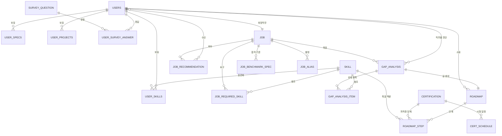

# 스펙 오디세이 — DB 설계 및 ERD

> 요구사항 명세서(총정리본 v2) 기준으로 설계한 테이블 36개. 관계 44개, 컬럼 227개.
> 이 문서가 스키마의 기준입니다. 구조를 바꿔야 하면 먼저 팀에 확인하세요.

## 공통 규칙

모든 테이블에 아래 3개 컬럼을 공통으로 둡니다. 개별 테이블 정의에서는 반복을 피해 생략했습니다.

```sql
created_at  DATETIME  NOT NULL DEFAULT CURRENT_TIMESTAMP,
updated_at  DATETIME  NOT NULL DEFAULT CURRENT_TIMESTAMP ON UPDATE CURRENT_TIMESTAMP,
is_deleted  BOOLEAN   NOT NULL DEFAULT FALSE
```

- 물리 삭제 금지. 조회 시 항상 `is_deleted = FALSE` 조건을 건다.
- 모든 FK에 인덱스를 건다.
- 문자셋 `utf8mb4` / `utf8mb4_unicode_ci`.

## ERD

### (A) 핵심 여정 도메인 — 가입 → 프로필 → 분석 → 길 제시



### (B) 확장 도메인 — 미션·인사이트·게이미피케이션·면접관

```mermaid
erDiagram
    USERS ||--o{ USER_SPECS : "보유"
    USERS ||--o{ USER_PROJECTS : "보유"
    USERS ||--o{ USER_SKILLS : "보유"
    USERS ||--o{ USER_SURVEY_ANSWER : "응답"
    USERS }o--|| JOB : "희망직무"
    SKILL ||--o{ USER_SKILLS : "표준화"
    SKILL ||--o{ JOB_REQUIRED_SKILL : "참조"
    JOB ||--o{ JOB_REQUIRED_SKILL : "요구"
    JOB ||--o{ JOB_BENCHMARK_SPEC : "합격 기준"
    SURVEY_QUESTION ||--o{ USER_SURVEY_ANSWER : "문항"
    CERTIFICATION ||--o{ CERT_SCHEDULE : "시험 일정"
    CERT_SCHEDULE ||--o{ DDAY_ALERT : "D-day 자동생성"
    USERS ||--o{ USER_DAILY_MISSION : "배정"
    PROBLEM ||--o{ USER_DAILY_MISSION : "출제"
    USERS ||--o{ SCORE_LOG : "적립"
    USERS ||--|| USER_SCORE_SUMMARY : "집계"
    LEVEL_TIER ||--o{ USER_SCORE_SUMMARY : "등급 기준"
    USERS ||--o{ SPEC_SCORE_HISTORY : "성장 기록"
    JOB ||--o{ JOB_SKILL_TREND : "시계열"
    SKILL ||--o{ JOB_SKILL_TREND : "기술"
    TREND_TECH ||--o{ TREND_TECH_JOB : "연관"
    JOB ||--o{ TREND_TECH_JOB : "연관"
    USERS ||--o{ SHARE_LINK : "발급"
    SHARE_LINK ||--o{ SHARE_LINK_VIEW_LOG : "열람"
    EVALUATION_SESSION ||--o{ EVALUATION_SESSION_ITEM : "비교 대상"
    SHARE_LINK ||--o{ EVALUATION_SESSION_ITEM : "포함"
    EVALUATION_SESSION ||--o{ EVALUATION_CRITERIA : "채점 기준"
    USERS ||--o{ DOCUMENTS : "업로드"
    USER_PROJECTS ||--o{ DOCUMENTS : "연결"
    USERS ||--o{ DDAY_ALERT : "등록"
    USERS ||--o{ AI_USAGE_LOG : "제출"
    SKILL ||--o{ EVALUATION_CRITERIA : "요구 역량"
    JOB ||--o{ JOB_ALIAS : "별칭"
```



## 테이블 정의

### 회원·프로필

#### USERS (회원)

관련 요구사항: FR-11 · 12 · 13 · 14 · 21 · 22

서비스의 모든 데이터가 매달리는 뿌리 테이블. 로그인 계정 정보와 전공·학년 같은 기본 신상, 그리고 "내가 가고 싶은 직무"를 담는다. 여기 한 줄이 지워지면 그 사람의 여정 전체가 사라진다.

| 컬럼 | 타입 | 키 | 설명 |
| --- | --- | --- | --- |
| `id` | BIGINT | PK | 회원 식별자 |
| `user_type` | VARCHAR(15) |  | APPLICANT(지원자) / INTERVIEWER(면접관) — 현재는 전부 APPLICANT |
| `login_id` | VARCHAR(50) | UK | 로그인 아이디 |
| `password_hash` | VARCHAR(255) |  | 해시+솔트 저장 (NFR-2) |
| `email` | VARCHAR(100) |  | 마감 알림 발송용 (선택 입력). 일반 인덱스, UNIQUE 아님 |
| `major` | VARCHAR(50) |  | 전공 |
| `grade` | VARCHAR(20) |  | 학년 |
| `interest_field` | VARCHAR(50) |  | 관심 분야 |
| `desired_job_id` | BIGINT | FK | 희망 직무 → JOB (없으면 NULL) |
| `desired_job_status` | VARCHAR(10) |  | SET / UNSET(아직 모르겠음) |
| `privacy_consent_at` | DATETIME |  | 민감정보 수집 동의 시점 (NFR-4) |
| `profile_updated_at` | DATETIME |  | 스펙·프로젝트·스킬 중 하나라도 바뀐 시각 — 재분석 판단 기준 |
| `last_login_at` | DATETIME |  | 마지막 접속 |

설계 판단:

- user_type은 지금 전부 '지원자'다. 면접관 계정을 나중에 붙일 때 테이블을 갈아엎지 않으려고 미리 뚫어둔 확장 필드(TD-4).
- email은 명세서 가입 항목에 없었지만 FR-73 이메일 알림을 살릴 여지를 두려고 추가하기로 했다. 선택 입력.
- profile_updated_at은 FR-37 재분석 트리거용이다. USERS.updated_at만으로는 안 된다. 사용자가 자격증을 추가해도 바뀌는 건 USER_SPECS이지 USERS가 아니라서, 자식 테이블 세 개의 MAX(updated_at)을 매번 구해야 한다. 자식이 바뀔 때 이 컬럼을 같이 찍어두면 GAP_ANALYSIS.analyzed_at과 한 번 비교하면 끝난다.
- 희망 직무가 없으면 desired_job_id가 NULL이고 desired_job_status가 UNSET이 된다. 이 값으로 "직무 발굴" 화면으로 보낼지 "격차 분석"으로 보낼지 갈린다.

#### USER_SPECS (보유 스펙)

관련 요구사항: FR-23 · 81(면접관 타임라인)

자격증·어학·수상을 한 줄씩 쌓는 곳. 한 사람이 여러 개를 가지므로 1:N이다. 취득일이 있어서 면접관 뷰의 시간순 타임라인(FR-81)을 그릴 때 정렬 기준이 된다.

| 컬럼 | 타입 | 키 | 설명 |
| --- | --- | --- | --- |
| `id` | BIGINT | PK | 식별자 |
| `user_id` | BIGINT | FK | → USERS |
| `spec_type` | VARCHAR(20) |  | CERT(자격증) / LANGUAGE(어학) / AWARD(수상) |
| `title` | VARCHAR(100) |  | 명칭 |
| `issuer` | VARCHAR(100) |  | 발급 기관 |
| `score` | VARCHAR(20) |  | 어학 점수 등 |
| `acquired_date` | DATE |  | 취득일 — 타임라인 정렬 기준 |

설계 판단:

- spec_type 하나로 세 종류를 구분한다. 자격증·어학·수상을 각각 테이블로 나누면 컬럼이 거의 같은 테이블이 셋 생기고 조회 쿼리도 셋으로 갈라진다.

#### USER_PROJECTS (프로젝트·경험)

관련 요구사항: FR-24

프로젝트와 경험을 쌓는 곳. 서류 보관함(DOCUMENTS)이 여기에 붙어서 "이 프로젝트의 산출물"로 묶인다.

| 컬럼 | 타입 | 키 | 설명 |
| --- | --- | --- | --- |
| `id` | BIGINT | PK | 식별자 |
| `user_id` | BIGINT | FK | → USERS |
| `title` | VARCHAR(150) |  | 프로젝트명 |
| `description` | TEXT |  | 설명 |
| `tech_stack` | VARCHAR(255) |  | 사용 기술 — 스킬 역산 보조 |
| `start_date` | DATE |  | 시작일 |
| `end_date` | DATE |  | 종료일 |

설계 판단:

- tech_stack을 둔 이유는 직무 발굴 때문이다. 사용자가 보유 기술을 따로 입력하지 않아도 프로젝트에 쓴 기술에서 역으로 스킬을 뽑아낼 수 있다(FR-38).

#### USER_SKILLS (보유 기술 스택)

관련 요구사항: FR-25 (필수로 격상)

사용자가 입력한 기술을 표준 스킬(SKILL)에 연결해 두는 다리. 이 연결이 있어야 "내 기술 vs 직무 요구 기술"을 DB에서 맞대어 볼 수 있다.

| 컬럼 | 타입 | 키 | 설명 |
| --- | --- | --- | --- |
| `id` | BIGINT | PK | 식별자 |
| `user_id` | BIGINT | FK | → USERS |
| `skill_id` | BIGINT | FK | → SKILL (매칭 실패 시 NULL) |
| `raw_input` | VARCHAR(100) |  | 사용자 입력 원문 — 항상 보존 |
| `similarity_score` | DECIMAL(5,4) |  | 원문↔표준 스킬 매칭 신뢰도 |
| `proficiency` | VARCHAR(20) |  | 숙련도 (선택) |

**복합 UNIQUE**: (user_id, skill_id) — 같은 기술을 두 번 입력해도 한 줄만 남는다

설계 판단:

- 명세서에서는 [권장]이었으나 [필수]로 올리기로 확정했다. 이 테이블이 없으면 임베딩 시맨틱 매칭이라는 차별화 포인트 자체가 성립하지 않는다.
- raw_input을 따로 보관하는 게 중요하다. 사용자가 "파이썬으로 데이터 만지기"라고 썼는데 표준 스킬 매칭에 실패해도 원문은 남아야 나중에 재매칭하거나 스킬 마스터를 보강할 수 있다.
- similarity_score는 "왜 이 스킬로 인식했는지"를 화면에서 설명할 근거가 된다.

#### SURVEY_QUESTION (설문 문항) — 신설

관련 요구사항: FR-38 · TD-5(d)

직무 발굴용 흥미·성향 문항과 초기 자가진단 문항을 함께 담는 문항 은행.

| 컬럼 | 타입 | 키 | 설명 |
| --- | --- | --- | --- |
| `id` | BIGINT | PK | 식별자 |
| `survey_type` | VARCHAR(20) |  | JOB_DISCOVERY(직무 발굴) / SELF_CHECK(자가진단) |
| `content` | VARCHAR(255) |  | 문항 내용 |
| `job_category_hint` | VARCHAR(50) |  | 이 응답이 가리키는 직무 계열 |
| `score_weight` | INT |  | 자가진단 초기 등급 배점 |

설계 판단:

- 직무 발굴 설문과 자가진단을 한 테이블에 survey_type으로 구분하기로 확정했다. 문항 구조가 같은데 테이블을 나누면 응답 저장·조회 로직이 통째로 중복된다.
- job_category_hint는 발굴 문항에서만, score_weight는 자가진단 문항에서만 쓴다. 서로 쓰지 않는 쪽은 NULL로 둔다.

#### USER_SURVEY_ANSWER (설문 응답) — 신설

관련 요구사항: FR-38

사용자가 문항에 답한 값. 직무 발굴에서는 후보 직무 추론 재료로, 자가진단에서는 첫 등급 산정 재료로 쓰인다.

| 컬럼 | 타입 | 키 | 설명 |
| --- | --- | --- | --- |
| `id` | BIGINT | PK | 식별자 |
| `user_id` | BIGINT | FK | → USERS |
| `question_id` | BIGINT | FK | → SURVEY_QUESTION |
| `answer_value` | INT |  | 점수형 응답 (1~5) |
| `answered_at` | DATETIME |  | 응답 시각 |

**복합 UNIQUE**: (user_id, question_id) — 재응답은 새 줄이 아니라 기존 값 갱신

설계 판단:

- 자가진단은 초기 1회만 인정한다(TD-5). answered_at으로 최초 응답인지 판별한다.

### 직무·격차 분석

#### SKILL (기술 마스터) — 신설

관련 요구사항: TD-1 임베딩 시맨틱 매칭

서비스가 아는 모든 기술의 표준 이름과 의미 벡터를 보관하는 사전. 사용자 스킬과 직무 요구 기술이 전부 여기를 거쳐 서로 연결된다. 이 서비스의 시맨틱 매칭이 작동하는 심장부.

| 컬럼 | 타입 | 키 | 설명 |
| --- | --- | --- | --- |
| `id` | BIGINT | PK | 식별자 |
| `skill_name` | VARCHAR(100) | UK | 표준 명칭 (예: Pandas) |
| `category` | VARCHAR(50) |  | 언어 / 프레임워크 / 도구 / 소프트스킬 |
| `embedding_vector` | TEXT |  | 의미 벡터 768차원 (JSON 배열) |
| `embedding_model` | VARCHAR(50) |  | 생성 모델명 — 모델 교체 시 재계산 대상 식별 |
| `embedded_at` | DATETIME |  | 벡터 생성 시각 |

설계 판단:

- 임베딩은 로컬 생성으로 확정했다. Java/Tomcat 환경이라 DJL + ONNX Runtime으로 한국어 모델(ko-sroberta-multitask, 768차원)을 올린다. 세팅에 1~2일은 잡아야 한다.
- embedding_model 컬럼을 남겨둔 이유: 로컬 세팅이 1주차에 안 잡히면 임베딩 API로 갈아탈 수 있고, 그때 어떤 벡터가 어느 모델 산출물인지 구분해 재계산 대상만 골라낼 수 있다.
- 벡터를 별도 컬럼으로 뺀 덕에 나중에 pgvector나 전용 벡터DB로 옮겨도 나머지 스키마는 손댈 필요가 없다.
- IT 계열 한정이라 500개 안팎이면 충분하고, 한 번 계산해 저장하면 재계산이 거의 없다.

#### JOB (직무 마스터) — 신설

관련 요구사항: TD-2 On-demand 수집

서비스가 다루는 직무 목록. 사용자가 입력한 직무명을 정규화한 결과가 여기 한 줄이 된다. 요구 기술·합격 기준·추천·격차 분석이 전부 이 테이블을 가리킨다.

| 컬럼 | 타입 | 키 | 설명 |
| --- | --- | --- | --- |
| `id` | BIGINT | PK | 식별자 |
| `job_name` | VARCHAR(100) | UK | 정규화된 직무명 |
| `job_category` | VARCHAR(50) |  | BACKEND / FRONTEND / DATA / DEVOPS / SECURITY / PM |
| `is_popular` | BOOLEAN |  | 사전 수집 대상 여부 |
| `last_collected_at` | DATETIME |  | 마지막 수집 시각 — 재수집 판단 기준 |

설계 판단:

- IT 계열로 한정하기로 확정했다. 초기 대상이 15~20개로 줄어 명세서 TD-2의 "수기 구축 5~10개"보다 넓은 커버리지를 확보할 수 있고, 스킬 마스터도 IT 기술로만 채워져 임베딩 품질이 올라간다.
- is_popular가 true면 미리 수집해 둔다(조회가 빠름). false면 사용자가 요청할 때 워크넷을 호출하고 결과를 캐싱해 다음 사용자부터 빨라진다.
- 재수집은 워크넷 배치 주 1회(일요일 새벽), On-demand 캐시는 TTL 7일로 추천.

#### JOB_REQUIRED_SKILL (직무 요구 기술) — 신설

관련 요구사항: TD-1 규칙기반 격차 분석

"이 직무는 어떤 기술을 얼마나 요구하는가"를 한 줄에 하나씩 담은 기준 데이터. 격차 분석이 사용자 스킬과 맞대어 보는 상대편이다.

| 컬럼 | 타입 | 키 | 설명 |
| --- | --- | --- | --- |
| `id` | BIGINT | PK | 식별자 |
| `job_id` | BIGINT | FK | → JOB |
| `skill_id` | BIGINT | FK | → SKILL |
| `importance` | VARCHAR(10) |  | REQUIRED(필수) / PREFERRED(우대) |
| `required_level` | VARCHAR(20) |  | 요구 수준 |
| `source` | VARCHAR(20) |  | WORKNET / LLM / MANUAL |
| `is_estimated` | BOOLEAN |  | 추정치 여부 → 화면에 "예시적 추정" 표기 |
| `collected_at` | DATETIME |  | 수집 시각 |

**복합 UNIQUE**: (job_id, skill_id) — 없으면 주 1회 재수집마다 같은 행이 계속 쌓인다

설계 판단:

- 초안에서는 이게 JSON 한 덩어리였다. 그러면 TD-1이 정의한 "규칙기반 DB 대조"를 SQL로 할 수 없고 인사이트 집계도 막힌다. 그래서 행 단위로 풀었다.
- is_estimated를 직무가 아니라 행에 둔 게 핵심이다. 한 직무 안에서도 워크넷 실측 기술과 대기업 보완용 LLM 추정 기술이 섞이므로, 직무 단위 플래그로는 어느 항목이 추정인지 구분할 수 없다.
- 대기업 요구스펙은 명세서 대안 B 확정 — LLM이 "해당 직무 대기업의 일반적 요구 역량"을 생성하고 화면에 "예시적 추정"으로 명시한다.

#### JOB_BENCHMARK_SPEC (합격 기준 스펙) — 신설

관련 요구사항: FR-46

직무별 "이 정도면 붙는다"는 기준 스펙. 로드맵의 최종 목적지 역할을 한다.

| 컬럼 | 타입 | 키 | 설명 |
| --- | --- | --- | --- |
| `id` | BIGINT | PK | 식별자 |
| `job_id` | BIGINT | FK | → JOB |
| `tier` | VARCHAR(20) |  | ENTRY / CORE / ADVANCED / EXPERT |
| `spec_type` | VARCHAR(20) |  | CERT / PROJECT / SKILL / LANGUAGE |
| `content` | VARCHAR(255) |  | 예: "정보처리기사", "실서비스 배포 경험" |
| `is_estimated` | BOOLEAN |  | 항상 true — 추정치 |
| `generated_at` | DATETIME |  | 수동 재생성 시점 |

설계 판단:

- 실제 합격자 데이터는 확보 경로가 없다. 그래서 LLM이 IT 직무별 최고 수준 기준을 생성해 채우기로 확정했다. 최소 합격선이 아니라 최고 합격률 기준이라, 사실상 끝이 없는 목적지다.
- is_estimated는 항상 true다. 추정치임을 화면에 반드시 노출해야 한다(TD-2 대안 C, 투명성).
- tier가 ROADMAP_STEP의 tier와 이어진다. ENTRY부터 EXPERT까지 단계가 연장되는 구조의 종착점.
- LLM 호출할 때마다 값이 흔들리면 사용자가 혼란스러우므로 자동 재생성은 하지 않고 수동 트리거로만 갱신한다.

#### CERTIFICATION (자격증 마스터) — 신설

관련 요구사항: FR-71 자동화

IT 자격증 사전. 로드맵의 자격증 단계와 D-day 알림을 이어주는 연결 고리.

| 컬럼 | 타입 | 키 | 설명 |
| --- | --- | --- | --- |
| `id` | BIGINT | PK | 식별자 |
| `cert_name` | VARCHAR(100) | UK | 자격증명 |
| `issuer` | VARCHAR(100) |  | 발급 기관 |
| `job_category` | VARCHAR(50) |  | 연관 IT 직무 계열 |
| `difficulty_level` | INT |  | 난이도 — 로드맵 tier 배치 기준 |

설계 판단:

- 자격증을 로드맵에 텍스트로만 두면 D-day 기능이 그 존재를 모른다. 마스터로 빼면 "로드맵에 정보처리기사가 있네 → 다음 회차 접수 D-14"를 자동으로 띄울 수 있어, FR-71이 수동 입력에서 자동 추천으로 바뀐다.
- IT 계열 한정이라 정보처리기사·SQLD·ADsP·리눅스마스터·AWS SAA 등 30~40개면 충분하다.
- difficulty_level이 로드맵 tier 배치 기준이 된다. 입문자에게 AWS 전문가 자격증을 첫 단계로 주면 안 되니까.
- job_category에는 6개 직무 계열 외에 `COMMON`(컴퓨터활용능력·정보처리기능사 등 특정 직무에 안 묶이는 범용 자격증)이 있다. **2주차 로드맵 생성 쿼리에서 반드시 `WHERE job_category IN (:target_category, 'COMMON')`로 조회해야 한다.** 대상 직무 하나로만 필터링하면 COMMON 자격증은 아무 로드맵에도 뜨지 않는 죽은 데이터가 된다.
- job_category는 단일 VARCHAR라 자격증 하나가 여러 직무에 걸치는 걸 표현하지 못한다(예: SQLD는 DATA이면서 BACKEND, AWS SAA는 DEVOPS이면서 BACKEND). 지금은 대표 카테고리 하나만 넣는다. 2주차에 로드맵 품질이 떨어지면 그때 TREND_TECH_JOB처럼 N:M 연결 테이블로 승격한다 — 1주차에 미리 늘리지 않는다.

#### CERT_SCHEDULE (자격증 시험 일정) — 신설

관련 요구사항: FR-71

자격증별 회차와 접수·시험일. D-day 알림이 여기서 날짜를 가져간다.

| 컬럼 | 타입 | 키 | 설명 |
| --- | --- | --- | --- |
| `id` | BIGINT | PK | 식별자 |
| `certification_id` | BIGINT | FK | → CERTIFICATION |
| `round_name` | VARCHAR(50) |  | 회차 (예: 2026년 2회) |
| `apply_start` | DATE |  | 접수 시작일 |
| `apply_end` | DATE |  | 접수 마감일 |
| `exam_date` | DATE |  | 시험일 |

설계 판단:

- 3~4주차에 만든다. 자격증 마스터만 있고 일정이 없으면 D-day 자동 생성이 안 된다.

#### JOB_ALIAS (직무명 별칭) — 신설

관련 요구사항: TD-2 On-demand 수집

사용자가 제각각 입력한 직무명 표기를 표준 직무 하나로 모아주는 사전.

| 컬럼 | 타입 | 키 | 설명 |
| --- | --- | --- | --- |
| `id` | BIGINT | PK | 식별자 |
| `job_id` | BIGINT | FK | → JOB (표준 직무) |
| `alias_name` | VARCHAR(100) | UK | 사용자 입력 표기 |
| `match_type` | VARCHAR(20) |  | MANUAL(수기) / EMBEDDING(유사도 매칭) |
| `similarity_score` | DECIMAL(5,4) |  | 임베딩 매칭 시 유사도 |

**복합 UNIQUE**: (alias_name) — 같은 표기가 두 직무를 가리키지 않게

설계 판단:

- 이게 없으면 On-demand 수집 전략이 무너진다. "백엔드 개발자", "백엔드개발", "Backend Developer", "서버 개발자"가 전부 JOB에 별개 행으로 들어가고, 워크넷 호출도 네 번 나가고, 요구 기술·시계열·합격 기준이 네 갈래로 쪼개진다.
- 신규 표기가 들어오면 임베딩 유사도로 기존 직무를 먼저 찾고, 일정 점수 이상이면 별칭으로 붙인다. 아니면 새 JOB을 만든다. match_type에 어떻게 연결됐는지를 남겨 나중에 오매칭을 걸러낸다.
- IT 계열 한정이라 초기 15~20개 직무에 별칭 3~5개씩만 넣어도 대부분 흡수된다.

### 로드맵·여정

#### GAP_ANALYSIS (격차 분석)

관련 요구사항: FR-31 · 37 · 42

"현재 나 vs 목표 직무"를 비교한 결과의 머리 부분. 언제 분석했고 전체 충족률이 얼마인지를 담는다. 상세 항목은 GAP_ANALYSIS_ITEM에 있다.

| 컬럼 | 타입 | 키 | 설명 |
| --- | --- | --- | --- |
| `id` | BIGINT | PK | 식별자 |
| `user_id` | BIGINT | FK | → USERS |
| `job_id` | BIGINT | FK | → JOB (목표 직무) |
| `match_rate` | DECIMAL(5,2) |  | 전체 충족률 — 완성도 게이지 재료 |
| `analyzed_at` | DATETIME |  | 분석 시각 — 재분석 판단 기준 |

설계 판단:

- 한 사용자가 여러 직무를 각각 진단할 수 있도록 1:N으로 확정했다. IT 계열 안에서 백엔드·데이터·DevOps를 저울질하는 건 자연스러운 행동이고, "어느 길로 갈지 비교한다"는 여정 컨셉과도 맞는다.
- analyzed_at이 프로필 변경 시 재분석 트리거 기준이 된다(FR-37). 프로필이 이 시각 이후에 바뀌었으면 다시 분석한다.
- match_rate는 대시보드 완성도 게이지(FR-41)의 재료로 그대로 쓰인다.

#### GAP_ANALYSIS_ITEM (격차 분석 항목) — 신설

관련 요구사항: FR-42 · 48

기술 하나하나에 대해 "충족했는지 부족한지"를 기록한 줄. 격차 비교표와 약점 히트맵이 전부 여기서 나온다.

| 컬럼 | 타입 | 키 | 설명 |
| --- | --- | --- | --- |
| `id` | BIGINT | PK | 식별자 |
| `gap_analysis_id` | BIGINT | FK | → GAP_ANALYSIS (UNIQUE — 1:1 보장) |
| `skill_id` | BIGINT | FK | → SKILL |
| `status` | VARCHAR(10) |  | MET(충족) / MISSING(부족) |
| `similarity_score` | DECIMAL(5,4) |  | 임베딩 유사도 — 판정 근거 |

설계 판단:

- 초안에서 result_json이던 것을 행으로 풀었다. 부족 역량 히트맵(FR-48)은 status='MISSING'으로 GROUP BY 하면 그냥 나온다. JSON이었다면 애플리케이션에서 파싱해야 했다.
- similarity_score는 "왜 이걸 충족으로 봤는지"의 근거다. 사용자가 "React를 안 썼는데 왜 충족이지?"라고 물으면 "Next.js 경험과 의미 유사도 0.87"이라고 답할 수 있다.

#### ROADMAP (로드맵 (길))

관련 요구사항: FR-32 · 36 · 37

격차 분석 결과로 만들어진 "앞으로 걸어갈 길" 한 벌. 이 서비스를 진단 도구가 아닌 여정 서비스로 만드는 핵심.

| 컬럼 | 타입 | 키 | 설명 |
| --- | --- | --- | --- |
| `id` | BIGINT | PK | 식별자 |
| `user_id` | BIGINT | FK | → USERS |
| `gap_analysis_id` | BIGINT | FK | → GAP_ANALYSIS (UNIQUE — 1:1 보장) |
| `version` | INT |  | 재분석 때마다 증가 |
| `is_active` | BOOLEAN |  | 같은 직무 내 최신 버전만 true |
| `is_primary` | BOOLEAN |  | 사용자당 1건 — 대시보드가 바라보는 메인 여정 |
| `target_level` | VARCHAR(20) |  | 목표 수준 (기본 EXPERT) |

**복합 UNIQUE**: (gap_analysis_id) — 격차 분석 1건에 로드맵이 하나만 붙도록 강제

설계 판단:

- is_primary는 사용자당 하나만 true다. 여러 직무를 진단할 수 있게 열어뒀지만, 매일 걷는 길은 하나여야 대시보드와 일일 미션이 흔들리지 않는다.
- version + is_active는 FR-37 때문이다. 프로필이 바뀌어 재분석하면 로드맵이 새로 생기는데, 덮어쓰면 이미 완료 체크한 단계 기록이 사라진다.
- target_level 기본값은 EXPERT다. 목표를 최소 합격선이 아니라 최고 수준으로 잡기로 했으므로 길이 계속 연장된다.

#### ROADMAP_STEP (로드맵 단계)

관련 요구사항: FR-32 · 33 · 36 · 43(여정 지도)

길 위의 한 걸음. ①자격증 → ②프로젝트 → ③스킬 순서로 "다음에 뭘 해야 하는지"를 알려준다. 여정 지도에 찍히는 점이 곧 이 테이블의 한 줄이다.

| 컬럼 | 타입 | 키 | 설명 |
| --- | --- | --- | --- |
| `id` | BIGINT | PK | 식별자 |
| `roadmap_id` | BIGINT | FK | → ROADMAP |
| `step_order` | INT |  | 단계 순서 |
| `step_type` | VARCHAR(20) |  | CERT / PROJECT / SKILL |
| `tier` | VARCHAR(20) |  | ENTRY / CORE / ADVANCED / EXPERT |
| `certification_id` | BIGINT | FK | → CERTIFICATION (CERT 단계일 때) |
| `related_skill_id` | BIGINT | FK | → SKILL (어떤 부족 역량을 메우는지) |
| `reason` | TEXT |  | "왜 지금 이걸 해야 하는지" (FR-33) |
| `is_completed` | BOOLEAN |  | 완료 체크 |
| `completed_at` | DATETIME |  | 완료 시각 — 점수 적립 근거 |

설계 판단:

- tier가 "끝없는 길" 구조를 담는 컬럼이다. ENTRY를 다 걸으면 CORE가, CORE를 마치면 ADVANCED가 열리는 식으로 로드맵이 계속 연장된다.
- 다만 한 번에 전 구간을 다 생성하면 신규 사용자에게 수십 단계가 쏟아져 오히려 이탈한다. 현재 tier + 다음 tier까지만 노출하고 나머지는 여정 지도에 흐리게 표시하기를 권한다.
- certification_id로 자격증 마스터와 이어져 D-day가 자동 생성된다.
- completed_at은 스코어 적립(SCORE_LOG)의 근거가 된다. 단계 완료당 +100점.
- 재분석으로 로드맵이 새 version으로 만들어질 때, 이전 version에서 완료한 단계는 승계해야 한다. 안 그러면 이미 딴 자격증을 다시 따라고 시킨다. CERT 단계는 USER_SPECS에 같은 자격증이 등록돼 있으면 생성 시점에 바로 완료 처리하는 편이 안전하다.

#### JOB_RECOMMENDATION (추천 직무)

관련 요구사항: FR-34 · 35 · 38 · 39

"아직 모르겠음"을 고른 사용자에게 제시하는 후보 직무 3~5개. 막다른 길을 만들지 않기 위한 장치.

| 컬럼 | 타입 | 키 | 설명 |
| --- | --- | --- | --- |
| `id` | BIGINT | PK | 식별자 |
| `user_id` | BIGINT | FK | → USERS |
| `job_id` | BIGINT | FK | → JOB (후보 직무) |
| `rank_order` | INT |  | 추천 순위 |
| `match_reason` | TEXT |  | 설문·임베딩 종합 근거 |
| `summary_json` | TEXT |  | 하는 일 / 필요 역량 / 전망 (표시 전용) |
| `is_selected` | BOOLEAN |  | 사용자가 고른 직무 |

**복합 UNIQUE**: (user_id, job_id) — 한 사용자에게 같은 직무가 두 번 추천되지 않게

설계 판단:

- 설문 응답과 보유 스펙 임베딩 역산을 AI가 종합해 후보를 뽑는다(FR-38).
- is_selected가 true가 되는 순간 그 job_id로 격차 분석이 시작된다. 후보만 보여주고 끝내면 사용자가 갈 곳이 없어지므로, 선택이 곧바로 다음 흐름으로 이어져야 한다(FR-39).
- summary_json은 이 설계에서 유일하게 남긴 JSON이다. 화면에 그대로 뿌리는 서술형 텍스트라 검색·집계 대상이 아니기 때문.

### 미션·성장 지표

#### PROBLEM (문제 풀) — 신설

관련 요구사항: FR-51 · 52 · TD-3

코딩테스트 문제 창고. 모든 사용자가 공유하는 공용 풀이다.

| 컬럼 | 타입 | 키 | 설명 |
| --- | --- | --- | --- |
| `id` | BIGINT | PK | 식별자 |
| `title` | VARCHAR(200) |  | 문제 제목 |
| `description` | TEXT |  | 본문 (AI 생성 문제만) |
| `difficulty_level` | INT |  | 내부 난이도 1~5 — 플랫폼 레벨과 매핑 |
| `source_type` | VARCHAR(20) |  | AI_GENERATED / EXTERNAL_LINK / OPEN_DATASET |
| `external_url` | VARCHAR(500) |  | 링크 추천형 — 콘텐츠 복제 금지 |
| `answer_key` | TEXT |  | AI 생성 문제 정답 검증용 |

설계 판단:

- 초안에서는 문제 자체와 "누구에게 언제 배정됐는지"가 한 테이블에 섞여 있었다. 그러면 같은 문제를 여러 사용자에게 다른 날 배정할 수 없다. 그래서 둘로 쪼갰다.
- 세 종류 출처가 섞인다 — AI 생성(본문 보유), 링크 추천(백준 N번 링크만), 오픈 라이선스 문제셋. 저작권 크롤링은 금지다(TD-3).
- answer_key는 AI 생성 문제에만 있다. 정답 검증 로직이 필요하기 때문.

#### USER_DAILY_MISSION (일일 미션 배정) — 신설

관련 요구사항: FR-51 · 52 · 53

"누가 언제 어떤 문제를 받았고 풀었는지". 여정을 매일 걷게 만드는 기록.

| 컬럼 | 타입 | 키 | 설명 |
| --- | --- | --- | --- |
| `id` | BIGINT | PK | 식별자 |
| `user_id` | BIGINT | FK | → USERS |
| `problem_id` | BIGINT | FK | → PROBLEM |
| `assigned_date` | DATE |  | 배정일 (복합 UK) |
| `is_completed` | BOOLEAN |  | 완료 체크 |
| `completed_at` | DATETIME |  | 완료 시각 |
| `is_correct` | BOOLEAN |  | 정답 여부 — 점수 배점 기준 |

**복합 UNIQUE**: (user_id, assigned_date, problem_id) — 같은 날 같은 문제 중복 배정 방지

설계 판단:

- (user_id, assigned_date, problem_id) 복합 UK로 같은 날 같은 문제가 중복 배정되지 않게 막는다.
- 난이도는 사용자의 현재 등급(USER_SCORE_SUMMARY)에 맞춰 조정된다. 비기너에게는 Lv1, 실전러에게는 Lv2~3(TD-5 c).
- 스트릭은 여기 두지 않고 USER_SCORE_SUMMARY에서 관리한다. 매번 로그 전체를 훑어 연속 일수를 세는 건 대시보드 조회마다 부담이다.

#### SCORE_LOG (점수 적립 로그) — 신설

관련 요구사항: TD-5 (a)

점수가 쌓인 사건을 한 줄씩 남기는 장부. 언제 무엇으로 몇 점을 받았는지가 전부 여기 있다.

| 컬럼 | 타입 | 키 | 설명 |
| --- | --- | --- | --- |
| `id` | BIGINT | PK | 식별자 |
| `user_id` | BIGINT | FK | → USERS |
| `signal_type` | VARCHAR(20) |  | ROADMAP / QUIZ / PROBLEM / DOCUMENT / SELF_CHECK |
| `ref_id` | BIGINT |  | 적립 근거 레코드 id — 중복 적립 방지 |
| `points` | INT |  | 획득 점수 |
| `earned_at` | DATETIME |  | 적립 시각 |

**복합 UNIQUE**: (user_id, signal_type, ref_id) — 중복 적립 방지의 실제 강제 수단

설계 판단:

- ref_id에 적립 근거 레코드의 id를 넣어 중복 적립을 막는다. 같은 로드맵 단계를 체크 해제했다가 다시 체크해도 점수가 두 번 들어가면 안 된다.
- 배점은 명세서 TD-5 값을 그대로 쓴다 — 로드맵 단계 완료 +100, 코테 정답 +10~30(난이도별), 문제 풀이 +5, 서류 등록 +30, 자가진단 초기 1회 +0~50.

#### LEVEL_TIER (등급 구간) — 신설

관련 요구사항: TD-5 (b)

누적 점수에 따른 등급과 호칭을 정의하는 기준표.

| 컬럼 | 타입 | 키 | 설명 |
| --- | --- | --- | --- |
| `id` | BIGINT | PK | 식별자 |
| `min_score` | INT |  | 구간 하한 |
| `max_score` | INT |  | 구간 상한 (최고 등급은 NULL) |
| `tier_name` | VARCHAR(50) |  | 등급명 (예: 실전러) |
| `title_name` | VARCHAR(50) |  | 호칭 (예: 정식 항해사) |
| `problem_level_min` | INT |  | 이 등급에 출제할 문제 난이도 하한 |
| `problem_level_max` | INT |  | 이 등급에 출제할 문제 난이도 상한 |

**복합 UNIQUE**: (min_score) — 등급 구간이 겹치지 않게

설계 판단:

- 등급 구간과 호칭을 코드가 아니라 데이터로 관리한다. 명세서 값(0~499 비기너/뉴비 항해사, 500~1499 취준생/견습 항해사, 1500~2999 실전러/정식 항해사, 3000~4999 취뽀 임박/선장, 5000~ 취뽀/전설의 선장)을 초기 INSERT로 넣는다.
- 팀 논의로 구간이나 호칭이 바뀌어도 UPDATE만 하면 되고 재배포가 필요 없다.
- 게임식이라 뒤로 갈수록 구간을 넓혀 레벨업이 점점 어려워지는 구조다.

#### USER_SCORE_SUMMARY (점수 집계) — 신설

관련 요구사항: TD-5

사용자별 누적 점수와 현재 등급, 스트릭을 미리 계산해 담아두는 캐시.

| 컬럼 | 타입 | 키 | 설명 |
| --- | --- | --- | --- |
| `user_id` | BIGINT | PK | → USERS — PK이자 FK (1:1) |
| `total_score` | INT |  | 누적 점수 (상한 없음) |
| `current_tier_id` | BIGINT | FK | → LEVEL_TIER |
| `streak_count` | INT |  | 연속 수행 일수 |
| `last_mission_date` | DATE |  | 마지막 미션 수행일 — 스트릭 유지 판정 |

**복합 UNIQUE**: user_id가 PK이므로 1:1이 자동 보장됨

설계 판단:

- 대시보드를 열 때마다 SCORE_LOG를 전부 SUM 하면 로그가 쌓일수록 느려진다. 점수 적립 시점에 여기를 함께 갱신한다.
- TD-5의 순환 참조 문제(길 진행률이 등급에 영향 → 등급이 다시 난이도를 정함)는 신규 유저의 첫 등급을 자가진단 + 서류/스펙만으로 산정해 끊는다.

#### SPEC_SCORE_HISTORY (스펙 점수 이력) — 신설

관련 요구사항: FR-41 · 45 · 84

시점별 스펙 완성도 점수 스냅샷. 또래 비교와 성장 잠재력 지표가 둘 다 이 한 테이블에서 나온다.

| 컬럼 | 타입 | 키 | 설명 |
| --- | --- | --- | --- |
| `id` | BIGINT | PK | 식별자 |
| `user_id` | BIGINT | FK | → USERS |
| `snapshot_date` | DATE |  | 기록 시점 |
| `completeness_score` | DECIMAL(5,2) |  | 스펙 완성도 점수 |
| `major` | VARCHAR(50) |  | 시점 전공 — 또래 비교 집계 키 |
| `grade` | VARCHAR(20) |  | 시점 학년 — 또래 비교 집계 키 |
| `is_seed` | BOOLEAN |  | 시연용 가상 데이터 여부 |

설계 판단:

- 실사용자가 없으면 "같은 전공·학년 평균"이 계산되지 않는다. 발표 때 가입자가 팀원 몇 명뿐일 가능성이 높으므로, is_seed로 시연용 가상 사용자 데이터를 넣고 화면에 "샘플 데이터 기준"을 명시하기로 확정했다.
- 시드 규모는 전공 3~4종 × 학년 4개 = 16조합, 조합당 25명 정도면 또래 비교가 그럴듯해 보인다.
- 실사용자가 쌓이면 is_seed = false 조건만 붙이면 된다.
- 성장 잠재력(FR-84)은 최근 스냅샷들의 기울기로 계산한다.

#### JOB_SKILL_TREND (직무 기술 시계열) — 신설

관련 요구사항: FR-47

"이 직무가 요구하는 기술이 시간에 따라 어떻게 변했는가"를 월별로 쌓아둔 스냅샷.

| 컬럼 | 타입 | 키 | 설명 |
| --- | --- | --- | --- |
| `id` | BIGINT | PK | 식별자 |
| `job_id` | BIGINT | FK | → JOB |
| `skill_id` | BIGINT | FK | → SKILL |
| `period_ym` | CHAR(6) |  | 집계 기준월 (YYYYMM) |
| `mention_count` | INT |  | 해당 월 언급 건수 |
| `mention_ratio` | DECIMAL(5,2) |  | 해당 월 공고 내 언급 비율 |

**복합 UNIQUE**: (job_id, skill_id, period_ym) — 같은 달 스냅샷 중복 적재 방지

설계 판단:

- 이 테이블이 없으면 FR-47은 구현 자체가 불가능하다. 현재 요구 기술만 덮어쓰면 과거 시점이 남지 않아 그릴 데이터가 존재하지 않는다.
- 시계열은 소급 생성이 안 된다. 4주차에 만들면 그래프에 점이 하나만 찍힌다. 2주차 워크넷 수집을 붙일 때부터 함께 쌓기 시작하거나, 발표 전 과거 데이터를 시연용으로 별도 적재해야 한다.
- 스냅샷 주기는 매월 1일 1회를 추천한다. period_ym이 월 단위라 그보다 잘게 쌓을 이유가 없다.

#### TREND_TECH (트렌드 기술)

관련 요구사항: FR-54 · 44(취업시장 트렌드)

우측 사이드바에 뉴스처럼 흘러가는 최신 기술 소식.

| 컬럼 | 타입 | 키 | 설명 |
| --- | --- | --- | --- |
| `id` | BIGINT | PK | 식별자 |
| `tech_name` | VARCHAR(100) |  | 기술명 |
| `summary` | TEXT |  | 노출 문구 |
| `source_url` | VARCHAR(500) |  | 출처 링크 |
| `published_at` | DATETIME |  | 게시 시각 — 최신순 정렬 |

설계 판단:

- 일 1회 갱신을 추천한다. 뉴스처럼 보이려면 매일 바뀌어야 한다.

#### TREND_TECH_JOB (트렌드-직무 연결) — 신설

관련 요구사항: FR-55

어떤 트렌드 기술이 어떤 직무와 관련 있는지를 잇는 다리. 사이드바를 사용자 직무에 맞춰 걸러내는 근거.

| 컬럼 | 타입 | 키 | 설명 |
| --- | --- | --- | --- |
| `id` | BIGINT | PK | 식별자 |
| `trend_tech_id` | BIGINT | FK | → TREND_TECH |
| `job_id` | BIGINT | FK | → JOB |
| `relevance_score` | DECIMAL(5,4) |  | 연관도 — 사이드바 필터링 기준 |

**복합 UNIQUE**: (trend_tech_id, job_id) — 같은 기술-직무 연결 중복 방지

설계 판단:

- 초안은 TREND_TECH에 related_job_category 단일 컬럼이었다. 그러면 "Docker가 백엔드·데이터·DevOps에 모두 해당"하는 상황을 표현할 수 없어 N:M으로 바꿨다.
- relevance_score는 임베딩 유사도 기반이라 키워드가 달라도 의미로 연결된다(FR-55).

### 면접관 평가

#### SHARE_LINK (공유 링크)

관련 요구사항: FR-85 · 86 · NFR-9

지원자가 발급하는 비공개 열람 링크. 면접관은 로그인 없이 이 토큰으로만 이력을 읽는다.

| 컬럼 | 타입 | 키 | 설명 |
| --- | --- | --- | --- |
| `id` | BIGINT | PK | 식별자 |
| `user_id` | BIGINT | FK | → USERS (지원자 본인) |
| `token` | VARCHAR(64) | UK | 추측 불가 랜덤 문자열 |
| `is_active` | BOOLEAN |  | 지원자가 언제든 공유 중단 가능 |
| `expires_at` | DATETIME |  | 만료 시각 |
| `scope_basic` | BOOLEAN |  | 전공·자격증·프로젝트 타임라인 공개 (기본 true) |
| `scope_skills` | BOOLEAN |  | 보유 기술 스택 공개 — 적합도 스코어링에 필요 |
| `scope_growth` | BOOLEAN |  | 성장 잠재력 지표 공개 |
| `label` | VARCHAR(50) |  | 지원자용 메모 (예: "A회사 지원") — 링크 여러 개 구분 |

설계 판단:

- scope_* 세 컬럼이 공개 범위를 통제한다. 토큰만 있으면 그 user_id의 모든 테이블을 읽을 수 있는 구조였는데, 부족 역량 히트맵·등급·코테 오답률·개인 서류가 전부 딸려 있어 지원자에게 불리하다. 애플리케이션 코드로만 막으면 화면 하나 추가하다 실수로 뚫린다.
- NFR-4(민감 데이터는 본인 동의·본인 선택 공유만)를 스키마 차원에서 지키는 장치이기도 하다. FR-102의 AI 활용 기록은 아예 공유 대상에서 제외한다.
- 탈퇴(USERS.is_deleted = true) 시 이 사용자의 모든 SHARE_LINK을 is_active = false로 내려야 한다. 논리 삭제라 행은 남는데 토큰이 살아 있으면 면접관이 계속 열람할 수 있다.
- 토큰은 추측 불가능한 랜덤 문자열이어야 한다(NFR-9). 읽기 전용이고 만료·비활성화가 가능하다.
- is_active를 지원자가 언제든 false로 바꿀 수 있어야 한다(FR-86). 공유를 중단할 권한은 지원자에게 있다.
- 면접관이 검색하거나 직접 조회하는 경로는 이번 범위에 없다. 링크를 받은 사람만 본다.

#### SHARE_LINK_VIEW_LOG (열람 기록) — 신설

관련 요구사항: (요구사항 외 추가)

공유 링크가 언제 누구에게 열렸는지 남기는 기록.

| 컬럼 | 타입 | 키 | 설명 |
| --- | --- | --- | --- |
| `id` | BIGINT | PK | 식별자 |
| `share_link_id` | BIGINT | FK | → SHARE_LINK |
| `viewed_at` | DATETIME |  | 열람 시각 |
| `viewer_ip` | VARCHAR(45) |  | 접근 IP |

설계 판단:

- 명세서에 없는 테이블이지만 두 가지 값이 있다. 지원자에게 "내 이력이 몇 번 열람됐는지" 보여줄 수 있고, 토큰이 유출됐을 때 비정상 접근을 확인할 근거가 된다.
- 우선순위는 낮다. 시간이 없으면 생략해도 나머지가 돌아간다.

#### EVALUATION_SESSION (평가 세션) — 신설

관련 요구사항: FR-82

면접관이 여러 지원자를 담아두는 장바구니. 계정 없이도 비교 뷰를 만들 수 있게 해주는 그릇.

| 컬럼 | 타입 | 키 | 설명 |
| --- | --- | --- | --- |
| `id` | BIGINT | PK | 식별자 |
| `session_token` | VARCHAR(64) | UK | 면접관 브라우저 세션 식별자 |
| `company_name` | VARCHAR(100) |  | 회사명 |
| `created_at` | DATETIME |  | 생성 시각 |
| `expires_at` | DATETIME |  | 세션 만료 — 없으면 익명 세션이 영구히 쌓인다 |

설계 판단:

- 초안의 가장 큰 구멍이 여기였다. FR-82는 "여러 지원자를 나란히 비교"인데 면접관 계정이 없으니(FR-14), 면접관이 받은 여러 토큰을 묶어둘 곳이 필요하다.
- 면접관이 공유 링크를 하나씩 입력해 장바구니처럼 담는 방식으로 확정했다. session_token은 브라우저 세션 식별자다.
- 지원자 한 명만 볼 때는 이 테이블 없이 링크만으로 충분하다. 비교 기능이 필요해서 생긴 구조다.

#### EVALUATION_SESSION_ITEM (평가 대상) — 신설

관련 요구사항: FR-82

장바구니에 담긴 지원자 한 명. 세션과 공유 링크를 잇는다.

| 컬럼 | 타입 | 키 | 설명 |
| --- | --- | --- | --- |
| `id` | BIGINT | PK | 식별자 |
| `session_id` | BIGINT | FK | → EVALUATION_SESSION |
| `share_link_id` | BIGINT | FK | → SHARE_LINK |
| `added_at` | DATETIME |  | 담은 시각 |

**복합 UNIQUE**: (session_id, share_link_id) — 같은 지원자를 장바구니에 두 번 담지 못하게

설계 판단:

- 세션 하나에 지원자 여러 명이 담긴다. 이 목록이 곧 비교 뷰의 열(column)이 된다.

#### EVALUATION_CRITERIA (평가 기준) — 신설

관련 요구사항: FR-83

회사가 요구하는 역량과 가중치. 지원자별 적합도 점수를 매기는 채점표.

| 컬럼 | 타입 | 키 | 설명 |
| --- | --- | --- | --- |
| `id` | BIGINT | PK | 식별자 |
| `session_id` | BIGINT | FK | → EVALUATION_SESSION |
| `skill_id` | BIGINT | FK | → SKILL (회사 요구 역량) |
| `weight` | INT |  | 가중치 — 적합도 스코어링 |

**복합 UNIQUE**: (session_id, skill_id) — 같은 역량에 가중치가 두 개 생기지 않게

설계 판단:

- 지원자 스킬과 이 기준을 JOIN하면 적합도 점수가 나온다. 격차 분석(GAP_ANALYSIS)과 같은 계산 로직을 재사용할 수 있다.
- [권장] 항목이라 필수 완료 후 시간이 되면 붙인다.

### 부가·시스템

#### DOCUMENTS (서류 보관함)

관련 요구사항: FR-61~64 · NFR-7

프로젝트 관련 서류를 업로드해 보관하는 곳.

| 컬럼 | 타입 | 키 | 설명 |
| --- | --- | --- | --- |
| `id` | BIGINT | PK | 식별자 |
| `user_id` | BIGINT | FK | → USERS |
| `project_id` | BIGINT | FK | → USER_PROJECTS (선택 연결) |
| `original_name` | VARCHAR(255) |  | 원본 파일명 — 화면 표시용 |
| `stored_name` | VARCHAR(255) |  | 저장 파일명 — 중복 방지 |
| `file_path` | VARCHAR(500) |  | 저장 경로 |
| `file_size` | BIGINT |  | 용량 제한 검증 |
| `mime_type` | VARCHAR(100) |  | 확장자 제한 검증 |
| `checksum` | VARCHAR(64) |  | 무결성 관리 |
| `uploaded_at` | DATETIME |  | 업로드 시각 |

설계 판단:

- original_name과 stored_name을 분리한 이유는 한글 파일명과 중복 파일명 때문이다. 원본명은 화면에 보여주고, 실제 저장은 충돌 없는 이름으로 한다.
- file_size·mime_type·checksum이 NFR-7(용량·확장자 제한, 무결성 관리)의 근거가 된다.
- FR-64(AI 챗봇이 서류를 읽어 답변)는 보류 항목이라 스키마만 준비하고 기능은 만들지 않는다.

#### DDAY_ALERT (D-day 알림)

관련 요구사항: FR-71 · 72 · 73

자격증 접수일·공채 마감일 같은 일정을 D-day로 띄우는 곳.

| 컬럼 | 타입 | 키 | 설명 |
| --- | --- | --- | --- |
| `id` | BIGINT | PK | 식별자 |
| `user_id` | BIGINT | FK | → USERS |
| `cert_schedule_id` | BIGINT | FK | → CERT_SCHEDULE (자동 생성 시) |
| `title` | VARCHAR(100) |  | 일정명 |
| `target_date` | DATE |  | 목표일 |
| `alert_type` | VARCHAR(20) |  | CERT / RECRUIT / CUSTOM |
| `is_notified` | BOOLEAN |  | 이메일 발송 여부 |

**복합 UNIQUE**: (user_id, cert_schedule_id) — 같은 시험 일정 D-day 중복 등록 방지

설계 판단:

- cert_schedule_id가 있으면 자격증 마스터에서 일정을 끌어와 자동 생성된다. 없으면 사용자가 직접 입력한 커스텀 일정이다.
- is_notified는 이메일 발송 여부(FR-73, [선택]). USERS.email이 있어야 동작한다.

#### EXTERNAL_API_CACHE (외부 API 캐시) — 신설

관련 요구사항: FR-111 · 112 · NFR-1

워크넷·LLM·임베딩 호출 결과를 저장해 두는 곳. API가 죽었을 때 대신 보여줄 마지막 보루.

| 컬럼 | 타입 | 키 | 설명 |
| --- | --- | --- | --- |
| `id` | BIGINT | PK | 식별자 |
| `api_type` | VARCHAR(20) |  | WORKNET / LLM / EMBEDDING |
| `request_key` | VARCHAR(255) |  | 직무명 등 요청 식별자 — api_type과 묶어야 유일 |
| `response_body` | TEXT |  | 캐싱된 응답 |
| `status` | VARCHAR(10) |  | SUCCESS / FAILED |
| `cached_at` | DATETIME |  | 캐싱 시각 |
| `expires_at` | DATETIME |  | 만료 시각 (TTL 7일) |

**복합 UNIQUE**: (api_type, request_key) — 단독 UNIQUE는 버그, 서로 다른 API의 같은 요청이 덮어써짐

설계 판단:

- request_key 단독 UNIQUE는 버그였다. 워크넷에 "백엔드 개발자"를 묻는 요청과 LLM에 같은 직무를 묻는 요청이 같은 키가 되어 서로 덮어쓴다. (api_type, request_key) 복합 UNIQUE여야 한다.
- FR-111·112는 "실패 시 직전 캐싱 결과로 대체 표시"를 요구한다. 직전 결과를 어딘가 저장해두지 않으면 이 요구사항은 성립하지 않는데, 초안에는 그 저장소가 없었다.
- 중복 호출 최소화(NFR-1)도 같은 테이블이 담당한다. request_key로 이미 받아온 결과가 있는지 먼저 확인한다.
- status가 FAILED면 화면에 "일시적으로 불러올 수 없음"을 안내한다(FR-112).

#### AI_USAGE_LOG (AI 활용 기록)

관련 요구사항: FR-101 · 102

사용자가 직접 제출한 AI 사용 기록. AI 리터러시를 강점으로 보여주는 리포트 재료.

| 컬럼 | 타입 | 키 | 설명 |
| --- | --- | --- | --- |
| `id` | BIGINT | PK | 식별자 |
| `user_id` | BIGINT | FK | → USERS |
| `usage_record_json` | TEXT |  | 사용자 제출 기록 |
| `is_shared` | BOOLEAN |  | 공유 여부 — 본인 선택 |

설계 판단:

- [선택] 항목이다. 여유 있을 때 붙인다.
- 민감 데이터이므로 공유 여부는 본인이 정한다(NFR-4). 긍정적 강점으로만 표현한다.

## 복합 UNIQUE 제약 요약 (DDL 작성 시 필수)

| 테이블 | 제약 |
| --- | --- |
| USER_SKILLS | (user_id, skill_id) — 같은 기술을 두 번 입력해도 한 줄만 남는다 |
| USER_SURVEY_ANSWER | (user_id, question_id) — 재응답은 새 줄이 아니라 기존 값 갱신 |
| JOB_REQUIRED_SKILL | (job_id, skill_id) — 없으면 주 1회 재수집마다 같은 행이 계속 쌓인다 |
| JOB_ALIAS | (alias_name) — 같은 표기가 두 직무를 가리키지 않게 |
| ROADMAP | (gap_analysis_id) — 격차 분석 1건에 로드맵이 하나만 붙도록 강제 |
| JOB_RECOMMENDATION | (user_id, job_id) — 한 사용자에게 같은 직무가 두 번 추천되지 않게 |
| USER_DAILY_MISSION | (user_id, assigned_date, problem_id) — 같은 날 같은 문제 중복 배정 방지 |
| SCORE_LOG | (user_id, signal_type, ref_id) — 중복 적립 방지의 실제 강제 수단 |
| LEVEL_TIER | (min_score) — 등급 구간이 겹치지 않게 |
| USER_SCORE_SUMMARY | user_id가 PK이므로 1:1이 자동 보장됨 |
| JOB_SKILL_TREND | (job_id, skill_id, period_ym) — 같은 달 스냅샷 중복 적재 방지 |
| TREND_TECH_JOB | (trend_tech_id, job_id) — 같은 기술-직무 연결 중복 방지 |
| EVALUATION_SESSION_ITEM | (session_id, share_link_id) — 같은 지원자를 장바구니에 두 번 담지 못하게 |
| EVALUATION_CRITERIA | (session_id, skill_id) — 같은 역량에 가중치가 두 개 생기지 않게 |
| DDAY_ALERT | (user_id, cert_schedule_id) — 같은 시험 일정 D-day 중복 등록 방지 |
| EXTERNAL_API_CACHE | (api_type, request_key) — 단독 UNIQUE는 버그, 서로 다른 API의 같은 요청이 덮어써짐 |
