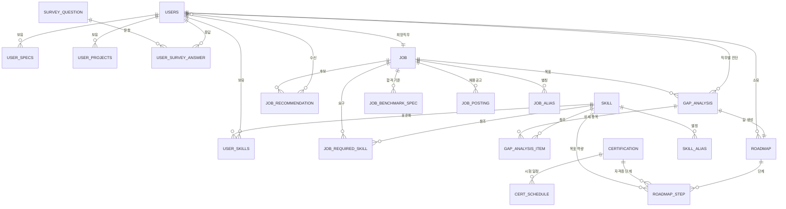
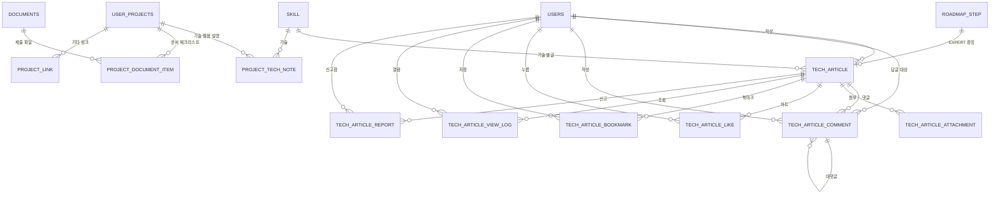

# 스펙 오디세이 — DB 설계 및 ERD

> 요구사항 명세서(총정리본 v2) 기준으로 설계한 테이블 49개. 관계(FK) 73개, 컬럼 340개(공통 컬럼 3개 제외).
> (2026-10-02 기준 — 기술 글 게시판 6개, 프로젝트 문서 2개, 프로젝트 기타 링크 1개가 늘었고 USERS에 복구 코드 해시 컬럼이 생겼다. 실제 DB와 `information_schema`로 대조해 맞춘 숫자다.)
> 이 문서가 스키마의 기준입니다. 구조를 바꿔야 하면 먼저 팀에 확인하세요.

## 공통 규칙

모든 테이블에 아래 3개 컬럼을 공통으로 둡니다. 개별 테이블 정의에서는 반복을 피해 생략했습니다.

```sql
created_at  DATETIME  NOT NULL DEFAULT CURRENT_TIMESTAMP,
updated_at  DATETIME  NOT NULL DEFAULT CURRENT_TIMESTAMP ON UPDATE CURRENT_TIMESTAMP,
is_deleted  BOOLEAN   NOT NULL DEFAULT FALSE
```

- 물리 삭제 금지. 조회 시 항상 `is_deleted = FALSE` 조건을 건다.
- 모든 FK에 인덱스를 건다.
- 문자셋 `utf8mb4` / `utf8mb4_unicode_ci`.

## ERD

### (A) 핵심 여정 도메인 — 가입 → 프로필 → 분석 → 길 제시


```mermaid
erDiagram
    USERS ||--o{ USER_SPECS : "보유"
    USERS ||--o{ USER_PROJECTS : "보유"
    USERS ||--o{ USER_SKILLS : "보유"
    USERS ||--o{ USER_SURVEY_ANSWER : "응답"
    USERS ||--o{ GAP_ANALYSIS : "직무별 진단"
    USERS ||--o{ JOB_RECOMMENDATION : "수신"
    USERS }o--|| JOB : "희망직무"
    SKILL ||--o{ USER_SKILLS : "표준화"
    SKILL ||--o{ JOB_REQUIRED_SKILL : "참조"
    SKILL ||--o{ GAP_ANALYSIS_ITEM : "참조"
    JOB ||--o{ JOB_REQUIRED_SKILL : "요구"
    JOB ||--o{ JOB_BENCHMARK_SPEC : "합격 기준"
    JOB ||--o{ JOB_RECOMMENDATION : "후보"
    JOB ||--o{ GAP_ANALYSIS : "목표"
    JOB ||--o{ JOB_POSTING : "채용공고"
    GAP_ANALYSIS ||--o{ GAP_ANALYSIS_ITEM : "상세 항목"
    GAP_ANALYSIS ||--|| ROADMAP : "길 생성"
    ROADMAP ||--o{ ROADMAP_STEP : "단계"
    CERTIFICATION ||--o{ ROADMAP_STEP : "자격증 단계"
    SURVEY_QUESTION ||--o{ USER_SURVEY_ANSWER : "문항"
    CERTIFICATION ||--o{ CERT_SCHEDULE : "시험 일정"
    JOB ||--o{ JOB_ALIAS : "별칭"
    SKILL ||--o{ SKILL_ALIAS : "별칭"
    USERS ||--o{ ROADMAP : "소유"
    SKILL ||--o{ ROADMAP_STEP : "목표 역량"
```

### (B) 확장 도메인 — 미션·인사이트·게이미피케이션·면접관


```mermaid
erDiagram
    USERS ||--o{ USER_SPECS : "보유"
    USERS ||--o{ USER_PROJECTS : "보유"
    USERS ||--o{ USER_SKILLS : "보유"
    USERS ||--o{ USER_SURVEY_ANSWER : "응답"
    USERS }o--|| JOB : "희망직무"
    SKILL ||--o{ USER_SKILLS : "표준화"
    SKILL ||--o{ JOB_REQUIRED_SKILL : "참조"
    JOB ||--o{ JOB_REQUIRED_SKILL : "요구"
    JOB ||--o{ JOB_BENCHMARK_SPEC : "합격 기준"
    SURVEY_QUESTION ||--o{ USER_SURVEY_ANSWER : "문항"
    CERTIFICATION ||--o{ CERT_SCHEDULE : "시험 일정"
    CERT_SCHEDULE ||--o{ DDAY_ALERT : "D-day 자동생성"
    USERS ||--o{ USER_DAILY_MISSION : "배정"
    PROBLEM ||--o{ USER_DAILY_MISSION : "출제"
    USERS ||--o{ SCORE_LOG : "적립"
    USERS ||--|| USER_SCORE_SUMMARY : "집계"
    LEVEL_TIER ||--o{ USER_SCORE_SUMMARY : "등급 기준"
    USERS ||--o{ SPEC_SCORE_HISTORY : "성장 기록"
    JOB ||--o{ JOB_SKILL_TREND : "시계열"
    SKILL ||--o{ JOB_SKILL_TREND : "기술"
    TREND_TECH ||--o{ TREND_TECH_JOB : "연관"
    JOB ||--o{ TREND_TECH_JOB : "연관"
    USERS ||--o{ SHARE_LINK : "발급"
    SHARE_LINK ||--o{ SHARE_LINK_VIEW_LOG : "열람"
    EVALUATION_SESSION ||--o{ EVALUATION_SESSION_ITEM : "비교 대상"
    SHARE_LINK ||--o{ EVALUATION_SESSION_ITEM : "포함"
    EVALUATION_SESSION ||--o{ EVALUATION_CRITERIA : "채점 기준"
    USERS ||--o{ DOCUMENTS : "업로드"
    USER_PROJECTS ||--o{ DOCUMENTS : "연결"
    USERS ||--o{ DDAY_ALERT : "등록"
    USERS ||--o{ NOTIFICATION : "받음"
    USERS ||--o{ AI_USAGE_LOG : "제출"
    SKILL ||--o{ EVALUATION_CRITERIA : "요구 역량"
    JOB ||--o{ JOB_ALIAS : "별칭"
    SKILL ||--o{ SKILL_ALIAS : "별칭"
    USERS }o--o| DOCUMENTS : "이력서·자소서(선택)"
```

### (C) 커뮤니티·프로젝트 문서 도메인 — 기술 글 게시판, 프로젝트 완료 서류


```mermaid
erDiagram
    USERS ||--o{ TECH_ARTICLE : "작성"
    SKILL ||--o{ TECH_ARTICLE : "기술별 글"
    ROADMAP_STEP ||--o| TECH_ARTICLE : "EXPERT 증빙"
    TECH_ARTICLE ||--o{ TECH_ARTICLE_COMMENT : "댓글"
    TECH_ARTICLE ||--o{ TECH_ARTICLE_ATTACHMENT : "첨부"
    USERS ||--o{ TECH_ARTICLE_COMMENT : "답글 대상"
    TECH_ARTICLE_COMMENT ||--o{ TECH_ARTICLE_COMMENT : "대댓글"
    USERS ||--o{ TECH_ARTICLE_COMMENT : "작성"
    TECH_ARTICLE ||--o{ TECH_ARTICLE_LIKE : "하트"
    USERS ||--o{ TECH_ARTICLE_LIKE : "누름"
    TECH_ARTICLE ||--o{ TECH_ARTICLE_BOOKMARK : "북마크"
    USERS ||--o{ TECH_ARTICLE_BOOKMARK : "저장"
    TECH_ARTICLE ||--o{ TECH_ARTICLE_VIEW_LOG : "조회"
    USERS ||--o{ TECH_ARTICLE_VIEW_LOG : "열람"
    TECH_ARTICLE ||--o{ TECH_ARTICLE_REPORT : "신고"
    USERS ||--o{ TECH_ARTICLE_REPORT : "신고함"
    USER_PROJECTS ||--o{ PROJECT_TECH_NOTE : "기술 활용 설명"
    SKILL ||--o{ PROJECT_TECH_NOTE : "기술"
    USER_PROJECTS ||--o{ PROJECT_DOCUMENT_ITEM : "문서 체크리스트"
    DOCUMENTS ||--o{ PROJECT_DOCUMENT_ITEM : "제출 파일"
    USER_PROJECTS ||--o{ PROJECT_LINK : "기타 링크"
```

## 테이블 정의

### 회원·프로필

#### USERS (회원)

관련 요구사항: FR-11 · 12 · 13 · 14 · 21 · 22

서비스의 모든 데이터가 매달리는 뿌리 테이블. 로그인 계정 정보와 전공·학년 같은 기본 신상, 그리고 "내가 가고 싶은 직무"를 담는다. 여기 한 줄이 지워지면 그 사람의 여정 전체가 사라진다.

| 컬럼 | 타입 | 키 | 설명 |
| --- | --- | --- | --- |
| `id` | BIGINT | PK | 회원 식별자 |
| `user_type` | VARCHAR(15) |  | APPLICANT(지원자) / INTERVIEWER(면접관) — 가입할 때 고른다 |
| `login_id` | VARCHAR(50) | UK | 로그인 아이디 |
| `password_hash` | VARCHAR(255) |  | 해시+솔트 저장 (NFR-2) |
| `name` | VARCHAR(50) |  | 이름 — 가입 시 필수. 공유 링크의 "기본 이력" 범위로 면접관에게 보인다 |
| `age` | INT |  | 나이 — 지원자 가입 시 필수 |
| `career_status` | VARCHAR(15) |  | STUDENT(학생) / JOB_SEEKER(취준생) / EMPLOYED(직장인) — 지원자 가입 시 필수 |
| `email` | VARCHAR(100) |  | 마감 알림 발송용 (선택 입력). 일반 인덱스, UNIQUE 아님 |
| `major` | VARCHAR(50) |  | 전공 |
| `grade` | VARCHAR(20) |  | 학년 — 구분이 학생일 때만 입력받는다 |
| `interest_field` | VARCHAR(50) |  | 관심 분야 |
| `desired_job_id` | BIGINT | FK | 희망 직무 → JOB (없으면 NULL) |
| `desired_job_status` | VARCHAR(10) |  | SET / UNSET(아직 모르겠음) |
| `resume_document_id` | BIGINT | FK | 이력서 파일 → DOCUMENTS (지정하지 않았으면 NULL) |
| `cover_letter_document_id` | BIGINT | FK | 자소서 파일 → DOCUMENTS (선택, 지정하지 않았으면 NULL) |
| `privacy_consent_at` | DATETIME |  | 민감정보 수집 동의 시점 (NFR-4) |
| `recovery_code_hash` | VARCHAR(255) |  | 비밀번호 찾기용 복구 코드의 해시(원문은 저장 안 함). NULL이면 코드가 없는 계정 |
| `profile_updated_at` | DATETIME |  | 스펙·프로젝트·스킬 중 하나라도 바뀐 시각 — 재분석 판단 기준 |
| `last_login_at` | DATETIME |  | 마지막 접속 |
| `withdraw_requested_at` | DATETIME |  | 탈퇴 신청 시각. 30일 유예 동안 아이디를 잡아 두고 탈퇴 취소 가능 |

설계 판단:

- user_type은 면접관 계정을 나중에 붙일 때 테이블을 갈아엎지 않으려고 미리 뚫어둔 확장 필드였다(TD-4). 면접관 계정을 도입하면서 실제로 쓰기 시작했다 — 면접관은 공유받은 이력·지원자 비교·내 프로필만 쓸 수 있다.
- (변경) name·age·career_status를 추가했다. 면접관이 여러 지원자를 비교할 때 "지원자 1, 2"로는 누가 누구인지 알 수 없어서 이름이 필요했고, 같이 나이와 구분(학생/취준생/직장인)을 가입 필수 항목으로 받기로 했다. 컬럼 추가 전에 가입한 회원은 값이 없어 NULL을 허용하고, 내 프로필에서 저장할 때 채우게 한다. 면접관 계정은 이름만 받는다. 이미 만든 DB에는 `sql/08_alter_users_profile.sql`을 실행한다.
- (변경) resume_document_id를 추가했다. 이력서는 파일로 저장하기로 했고, 파일 자체는 이미 있는 서류 보관함(DOCUMENTS)에 올린다. 이 컬럼은 그중 어느 파일이 "내 이력서"인지만 가리킨다 — 파일 경로·크기·체크섬을 USERS에 또 두면 DOCUMENTS와 같은 정보를 두 곳에서 관리하게 된다. USERS가 DOCUMENTS보다 먼저 만들어지므로 FK는 03_schema_extended.sql 끝에서 ALTER로 건다. 이미 만든 DB에는 `sql/09_alter_users_resume.sql`을 실행한다.
- (변경) cover_letter_document_id를 추가했다. 이력서와 같은 방식으로, 내 프로필에서 자소서를 **선택으로** 올려 두면 면접관이 공유 링크 하나로 이력서·자소서를 한눈에 볼 수 있다. 이력서·자소서 모두 안 올려도 가입·분석·로드맵에는 아무 지장이 없다(둘 다 NULL 허용). 파일은 DOCUMENTS에 한 행으로 저장하고 이 컬럼이 그 행을 가리킨다. 이력서와 자소서를 한 컬럼에 `종류` 구분으로 합치지 않고 컬럼을 따로 둔 이유는, 사용자당 각각 하나뿐이라 N:1 구조가 필요 없고 "내 이력서가 어느 파일인지"를 조인 없이 바로 읽을 수 있기 때문이다.
- (변경) recovery_code_hash를 추가했다(2026-10-02). 메일 발송 수단이 없어도 되는 비밀번호 찾기 방식 — 가입(또는 프로필 재발급) 때 16자 복구 코드를 화면에 한 번만 보여 주고 서버에는 비밀번호와 같은 방식(Argon2id)의 해시만 둔다. 이메일은 선택 입력이라 메일 재설정으로는 모든 계정을 못 구하고, 코드는 쓰면 새 코드로 바뀌며 재발급하면 이전 코드는 무효가 된다. NULL은 코드가 없는 계정(이 기능 이전 가입자)이다.
- (변경) 비밀번호·복구 코드 해시를 PBKDF2-SHA256에서 Argon2id(m=19MiB, t=2, p=1)로 바꿨다(2026-10-07). 형식은 `$argon2id$v=19$...` PHC 문자열(약 100자)이라 VARCHAR(255) 그대로 쓴다. 예전 `{반복}:{솔트}:{해시}` 값도 검증은 계속 되고, 로그인에 성공하면 그 자리에서 Argon2id로 다시 저장한다 — 스키마 변경·데이터 이관은 필요 없다.
- (변경) withdraw_requested_at을 추가했다(2026-10-03, 팀 확인). 탈퇴를 즉시 확정하지 않고 30일 유예를 둔다. 탈퇴하면 is_deleted = TRUE + 신청 시각만 남기고 아이디는 그대로 잡아 둔다 — 그동안 같은 아이디로 다른 사람이 가입할 수 없어서, 30일 안에 같은 아이디·비밀번호로 로그인하면 "탈퇴 취소" 한 번으로 원래 아이디 그대로 돌아온다("아이디가 이미 사용 중" 상황이 생기지 않는다). 유예 중에도 복구 코드로 비밀번호를 찾을 수 있다. 30일이 지나면 WithdrawalPurgeScheduler가 아이디를 `del_<id>_`로 비우고 이름·나이·구분·이메일·복구 코드를 지운다(행은 논리 삭제 원칙대로 남긴다). is_deleted = TRUE인데 이 값이 NULL이면 이 컬럼 이전에 탈퇴한 계정(유예 없음)이다. 이미 만든 DB에는 `sql/21_alter_users_withdraw_requested_at.sql`을 실행하고, 그 뒤로는 `18_fix_withdrawn_login_id.sql`을 다시 실행하지 않는다(유예 중인 아이디까지 비워 버린다).
- email은 명세서 가입 항목에 없었지만 FR-73 이메일 알림을 살릴 여지를 두려고 추가하기로 했다. 선택 입력.
- profile_updated_at은 FR-37 재분석 트리거용이다. USERS.updated_at만으로는 안 된다. 사용자가 자격증을 추가해도 바뀌는 건 USER_SPECS이지 USERS가 아니라서, 자식 테이블 세 개의 MAX(updated_at)을 매번 구해야 한다. 자식이 바뀔 때 이 컬럼을 같이 찍어두면 GAP_ANALYSIS.analyzed_at과 한 번 비교하면 끝난다.
- 희망 직무가 없으면 desired_job_id가 NULL이고 desired_job_status가 UNSET이 된다. 이 값으로 "직무 발굴" 화면으로 보낼지 "격차 분석"으로 보낼지 갈린다.

#### USER_SPECS (보유 스펙)

관련 요구사항: FR-23 · 81(면접관 타임라인)

자격증·어학·수상을 한 줄씩 쌓는 곳. 한 사람이 여러 개를 가지므로 1:N이다. 취득일이 있어서 면접관 뷰의 시간순 타임라인(FR-81)을 그릴 때 정렬 기준이 된다.

| 컬럼 | 타입 | 키 | 설명 |
| --- | --- | --- | --- |
| `id` | BIGINT | PK | 식별자 |
| `user_id` | BIGINT | FK | → USERS |
| `spec_type` | VARCHAR(20) |  | CERT(자격증) / LANGUAGE(어학) / AWARD(수상) / EXPERIENCE(경험 — 인턴·대외활동·교육) |
| `title` | VARCHAR(100) |  | 명칭 |
| `issuer` | VARCHAR(100) |  | 발급 기관 |
| `score` | VARCHAR(20) |  | 어학 점수 등 |
| `acquired_date` | DATE |  | 취득일 — 타임라인 정렬 기준. EXPERIENCE면 시작일 |
| `end_date` | DATE |  | EXPERIENCE의 종료일 — 진행 중이면 NULL. 다른 유형은 항상 NULL |

설계 판단:

- spec_type 하나로 세 종류를 구분한다. 자격증·어학·수상을 각각 테이블로 나누면 컬럼이 거의 같은 테이블이 셋 생기고 조회 쿼리도 셋으로 갈라진다.
- (변경, 2026-10-07) EXPERIENCE와 end_date를 추가했다(`sql/31_alter_interviewer_view_upgrade.sql`). FR-81 타임라인 순서(전공→자격증→프로젝트→**경험**)에 경험이 있는데 담을 곳이 없었다. 인턴·대외활동은 기관(issuer)·기간이 있다는 점만 다르고 나머지가 같아서 새 테이블 대신 유형 하나와 종료일 컬럼만 더했다. 경험은 면접관 뷰에서 "시작일 ~ 종료일(진행 중)"로 보인다.

#### USER_PROJECTS (프로젝트·경험)

관련 요구사항: FR-24

프로젝트와 경험을 쌓는 곳. 서류 보관함(DOCUMENTS)이 여기에 붙어서 "이 프로젝트의 산출물"로 묶인다.

| 컬럼 | 타입 | 키 | 설명 |
| --- | --- | --- | --- |
| `id` | BIGINT | PK | 식별자 |
| `user_id` | BIGINT | FK | → USERS |
| `title` | VARCHAR(150) |  | 프로젝트명 |
| `description` | TEXT |  | 설명 |
| `tech_stack` | VARCHAR(255) |  | 사용 기술 — 스킬 역산 보조 |
| `start_date` | DATE |  | 시작일 |
| `end_date` | DATE |  | 종료일 |
| `upgraded_from_project_id` | BIGINT | FK | → USER_PROJECTS(자기참조). "기존 프로젝트 업그레이드"로 로드맵 CORE/ADVANCED SKILL 단계를 완료했을 때 이전 버전 연결. NULL이면 신규 프로젝트 |
| `repo_url` | VARCHAR(500) |  | 코드 저장소 링크 — 파일 스크린샷보다 실제로 열어볼 수 있는 링크가 신뢰도가 높다. 완료 판정에는 안 쓴다(참고용) |
| `deploy_url` | VARCHAR(500) |  | 배포 주소 (선택) — 있으면 완성도가 확실히 보이지만 강제하면 4주 일정에 부담이라 NULL 허용 |
| `retrospective` | TEXT |  | 완료 회고 2~3줄 — "업그레이드했다"는 사실만이 아니라 무엇을 배우고 해결했는지. 완료 판정에는 안 쓴다 |
| `team_size` | INT |  | 팀 인원(본인 포함). 1이면 개인 프로젝트, 미입력 NULL |
| `my_role` | VARCHAR(100) |  | 본인 역할 — 예) "백엔드 API · DB 설계" |

설계 판단:

- tech_stack을 둔 이유는 직무 발굴 때문이다. 사용자가 보유 기술을 따로 입력하지 않아도 프로젝트에 쓴 기술에서 역으로 스킬을 뽑아낼 수 있다(FR-38).
- upgraded_from_project_id는 2026-09-30 팀 결정(SKILL 단계 학습 검증)에서 추가됐다. CORE/ADVANCED는 "신규/업그레이드 둘 다 허용"이 원칙이라, 둘을 구분해서 로드맵 여정에 "이 프로젝트를 발전시켰다"는 이력을 남길 수 있게 한다.

- (변경) repo_url·deploy_url·retrospective를 추가했다(개발일지 4-4, 2026-09-30 확정). 지금까지 프로젝트 완료는 증빙 파일 업로드만으로 판정돼서 실제 동작 여부·학습 맥락·최소한의 문서화가 하나도 안 남았다는 문제 제기가 있었다. 세 값 모두 완료 판정에는 쓰지 않는다 — 판정은 PROJECT_DOCUMENT_ITEM의 필수 두 종류(README·실행 화면)로 한다.
- (변경, 2026-10-07) team_size·my_role을 추가했다(`sql/31_alter_interviewer_view_upgrade.sql`). 면접관이 프로젝트에서 가장 먼저 확인하는 것이 "몇 명 중 무엇을 맡았나"(기여도)인데 담을 곳이 없었다. 프로필 화면에서만 고치고(`UserProjectDao.updateTeamInfo`), 로드맵 제출이 쓰는 `update()`에는 넣지 않았다 — 그 폼에는 이 칸이 없어서 넣으면 제출할 때마다 지워진다.

#### USER_EDUCATION (학력) — 신설

관련 요구사항: FR-81 이력 · NFR-4 공개 범위

최종 학력 한 줄. USERS에는 전공·학년만 있어서 면접관이 서류에서 보는 학교·졸업(예정)·학점을 담을 곳이 없었다.

| 컬럼 | 타입 | 키 | 설명 |
| --- | --- | --- | --- |
| `id` | BIGINT | PK | 식별자 |
| `user_id` | BIGINT | FK, UK | → USERS (계정당 하나) |
| `school_name` | VARCHAR(100) |  | 학교 이름 |
| `graduation_status` | VARCHAR(20) |  | ENROLLED(재학) / LEAVE(휴학) / EXPECTED(졸업 예정) / GRADUATED(졸업) |
| `graduation_date` | DATE |  | 졸업일 또는 졸업 예정일 |
| `gpa` | DECIMAL(3,2) |  | 학점 (선택) |
| `gpa_max` | DECIMAL(3,2) |  | 만점 4.5 / 4.3 / 4.0 — 학점을 넣으면 같이 넣는다 |

**UNIQUE**: (user_id) — 계정당 최종 학력 한 줄. 저장은 upsert 하나로 처리한다

설계 판단:

- USERS에 컬럼을 더하지 않고 테이블을 따로 뒀다. USERS는 여러 팀원이 같이 고치는 중심 테이블이라 매퍼(UserDao)를 건드리면 병합 충돌이 잦고, 학력은 선택 입력이라 비어 있는 계정이 많다.
- 학점만으로는 4.5 만점인지 4.3 만점인지 알 수 없어 만점을 같이 받는다. 학점이 있는데 만점이 없으면 저장하지 않는다.
- 학력은 블라인드 채용을 고려해 기본 이력(scope_basic)에 묶지 않고 SHARE_LINK.scope_education으로 따로 공개한다.
- 탈퇴 유예가 끝나면 USERS 개인정보와 함께 학교·학점을 비운다(`UserEducationDao.purgeExpiredWithdrawals`).

#### PROJECT_TECH_NOTE (프로젝트 기술 활용 설명서) — 신설

관련 요구사항: FR-24 · NFR-4 · 개발일지 4-4

프로젝트에 등록한 기술마다 "어떻게 활용했는지"를 문장으로 받는 곳. USER_SKILLS.raw_input이 짧은 원문↔표준 스킬을 쌍으로 저장하는 것과 같은 발상이지만, 이건 문장 단위의 실사용 맥락이라 데이터가 훨씬 풍부하다.

| 컬럼 | 타입 | 키 | 설명 |
| --- | --- | --- | --- |
| `id` | BIGINT | PK | 식별자 |
| `project_id` | BIGINT | FK | → USER_PROJECTS |
| `skill_id` | BIGINT | FK | → SKILL |
| `description` | TEXT |  | 이 기술을 어떻게 활용했는지 |
| `consent_for_training` | BOOLEAN |  | 학습 데이터 활용 동의, 기본 false |

설계 판단:

- 예: "Redis로 세션 캐싱"과 "Redis를 메시지 큐로 사용"은 같은 기술이지만 활용 맥락이 다르다. 이런 차이를 쌓아두면 나중에 임베딩 모델을 이 서비스 도메인에 맞게 보정할 실제 데이터가 된다.
- 명세서 NFR-4("민감 데이터는 본인 동의·본인 선택 공유만")를 지키려고 consent_for_training을 같이 받는다. 체크하지 않아도 회고·완료 처리에는 지장이 없고, 동의한 것만 나중에 학습 데이터로 뽑는다. 소급 동의를 구하는 건 훨씬 번거로워서 받을 때부터 같이 받기로 했다.
- 복합 UNIQUE (project_id, skill_id)를 걸었다 — 한 프로젝트에서 같은 기술의 설명서가 두 개 생기지 않게. (개발일지 4-4에는 UNIQUE 언급이 없어 이번에 추가한 판단이다. 같은 기술을 한 프로젝트에서 여러 용도로 썼다면 한 줄에 함께 적는 것으로 갈음한다.)

#### PROJECT_DOCUMENT_ITEM (프로젝트 문서 체크리스트) — 신설

관련 요구사항: FR-24 · FR-61~63 · 개발일지 4-4

README·실행 화면 캡처·기획서·설계 문서·API 명세서·테스트 결과서·발표자료를 종류별로 "제출" 또는 "해당 없음"으로 받는 곳. 실제 파일은 기존 DOCUMENTS를 그대로 재사용한다.

| 컬럼 | 타입 | 키 | 설명 |
| --- | --- | --- | --- |
| `id` | BIGINT | PK | 식별자 |
| `project_id` | BIGINT | FK | → USER_PROJECTS |
| `doc_type` | VARCHAR(30) |  | README / SCREENSHOT / PLANNING / DESIGN / API_SPEC / TEST_REPORT / PRESENTATION |
| `status` | VARCHAR(20) |  | SUBMITTED(제출) / NOT_APPLICABLE(해당 없음) |
| `document_id` | BIGINT | FK | → DOCUMENTS. SUBMITTED일 때만 채운다 |

설계 판단:

- 전부 강제하면 없는 프로젝트도 억지로 빈 문서를 만들어 올리는 부작용이 생긴다. 그래서 문서 종류마다 "제출" 또는 "없음" 버튼을 두는 방식으로 확정했다.
- 필수는 README와 SCREENSHOT 둘뿐이다. 이 둘은 "없음"을 못 누른다(애플리케이션 규칙). 5분이 안 걸리면서 "이게 실제로 존재하고 동작한다"는 최소 증빙이 확실히 되고, 그 이상 늘리면 학습 로직 자체를 회피하게 될 위험이 있다.
- 완료 판정 규칙: doc_type이 README, SCREENSHOT인 두 행의 status가 둘 다 SUBMITTED여야 로드맵 PROJECT 단계를 완료 처리한다.
- 복합 UNIQUE (project_id, doc_type) — 같은 종류 문서를 중복 체크하지 않게.

#### PROJECT_LINK (프로젝트 기타 링크) — 신설

관련 요구사항: FR-24 · FR-81

저장소(repo_url)·배포(deploy_url) 말고도 블로그 글, 발표 영상, 노션 등 프로젝트를 보여줄 링크를 이름 + 주소로 프로젝트당 최대 5개까지 받는 곳. 면접관 공유 타임라인에도 같이 보인다.

| 컬럼 | 타입 | 키 | 설명 |
| --- | --- | --- | --- |
| `id` | BIGINT | PK | 식별자 |
| `project_id` | BIGINT | FK | → USER_PROJECTS |
| `label` | VARCHAR(50) |  | 링크 이름(예: 블로그 글). 비워도 된다 |
| `url` | VARCHAR(500) |  | http/https 주소 |
| `sort_order` | INT |  | 입력 순서 |

설계 판단:

- 링크가 늘어날 때마다 USER_PROJECTS에 컬럼을 더하지 않으려고 별도 테이블로 뒀다. 이름(label)은 비워도 되고, 비우면 화면에서 주소의 도메인을 대신 보여준다.
- 수정은 "프로젝트의 링크를 통째로 바꾸는" 한 동작이다 — 기존 줄을 is_deleted로 지우고 새로 넣는다. 그래서 UNIQUE를 두지 않았고 sort_order로 입력 순서를 지킨다.
- 주소는 http/https만 허용한다. 저장할 때와 면접관 화면에 내보낼 때 둘 다 확인해서 javascript: 같은 주소가 링크로 실행되지 않게 한다(NFR-4 취지). 프로젝트당 최대 5개는 애플리케이션 규칙이다.

#### USER_SKILLS (보유 기술 스택)

관련 요구사항: FR-25 (필수로 격상)

사용자가 입력한 기술을 표준 스킬(SKILL)에 연결해 두는 다리. 이 연결이 있어야 "내 기술 vs 직무 요구 기술"을 DB에서 맞대어 볼 수 있다.

| 컬럼 | 타입 | 키 | 설명 |
| --- | --- | --- | --- |
| `id` | BIGINT | PK | 식별자 |
| `user_id` | BIGINT | FK | → USERS |
| `skill_id` | BIGINT | FK | → SKILL (매칭 실패 시 NULL) |
| `raw_input` | VARCHAR(100) |  | 사용자 입력 원문 — 항상 보존 |
| `similarity_score` | DECIMAL(5,4) |  | 원문↔표준 스킬 매칭 신뢰도 |
| `proficiency` | VARCHAR(20) |  | 숙련도 (선택) |

**복합 UNIQUE**: (user_id, skill_id) — 같은 기술을 두 번 입력해도 한 줄만 남는다

설계 판단:

- 명세서에서는 [권장]이었으나 [필수]로 올리기로 확정했다. 이 테이블이 없으면 임베딩 시맨틱 매칭이라는 차별화 포인트 자체가 성립하지 않는다.
- raw_input을 따로 보관하는 게 중요하다. 사용자가 "파이썬으로 데이터 만지기"라고 썼는데 표준 스킬 매칭에 실패해도 원문은 남아야 나중에 재매칭하거나 스킬 마스터를 보강할 수 있다.
- similarity_score는 "왜 이 스킬로 인식했는지"를 화면에서 설명할 근거가 된다.

#### SURVEY_QUESTION (설문 문항) — 신설

관련 요구사항: FR-38 · TD-5(d)

직무 발굴용 흥미·성향 문항과 초기 자가진단 문항을 함께 담는 문항 은행.

| 컬럼 | 타입 | 키 | 설명 |
| --- | --- | --- | --- |
| `id` | BIGINT | PK | 식별자 |
| `survey_type` | VARCHAR(20) |  | JOB_DISCOVERY(직무 발굴) / SELF_CHECK(자가진단) |
| `content` | VARCHAR(255) |  | 문항 내용 |
| `job_category_hint` | VARCHAR(50) |  | 이 응답이 가리키는 직무 계열 |
| `score_weight` | INT |  | 자가진단 초기 등급 배점 |

설계 판단:

- 직무 발굴 설문과 자가진단을 한 테이블에 survey_type으로 구분하기로 확정했다. 문항 구조가 같은데 테이블을 나누면 응답 저장·조회 로직이 통째로 중복된다.
- job_category_hint는 발굴 문항에서만, score_weight는 자가진단 문항에서만 쓴다. 서로 쓰지 않는 쪽은 NULL로 둔다.

#### USER_SURVEY_ANSWER (설문 응답) — 신설

관련 요구사항: FR-38

사용자가 문항에 답한 값. 직무 발굴에서는 후보 직무 추론 재료로, 자가진단에서는 첫 등급 산정 재료로 쓰인다.

| 컬럼 | 타입 | 키 | 설명 |
| --- | --- | --- | --- |
| `id` | BIGINT | PK | 식별자 |
| `user_id` | BIGINT | FK | → USERS |
| `question_id` | BIGINT | FK | → SURVEY_QUESTION |
| `answer_value` | INT |  | 점수형 응답 (1~5) |
| `answered_at` | DATETIME |  | 응답 시각 |

**복합 UNIQUE**: (user_id, question_id) — 재응답은 새 줄이 아니라 기존 값 갱신

설계 판단:

- 자가진단은 초기 1회만 인정한다(TD-5). answered_at으로 최초 응답인지 판별한다.

### 직무·격차 분석

#### SKILL (기술 마스터) — 신설

관련 요구사항: TD-1 임베딩 시맨틱 매칭

서비스가 아는 모든 기술의 표준 이름과 의미 벡터를 보관하는 사전. 사용자 스킬과 직무 요구 기술이 전부 여기를 거쳐 서로 연결된다. 이 서비스의 시맨틱 매칭이 작동하는 심장부.

| 컬럼 | 타입 | 키 | 설명 |
| --- | --- | --- | --- |
| `id` | BIGINT | PK | 식별자 |
| `skill_name` | VARCHAR(100) | UK | 표준 명칭 (예: Pandas) |
| `category` | VARCHAR(50) |  | 언어 / 프레임워크 / 도구 / 소프트스킬 |
| `embedding_vector` | TEXT |  | 의미 벡터 768차원 (JSON 배열) |
| `embedding_model` | VARCHAR(50) |  | 생성 모델명 — 모델 교체 시 재계산 대상 식별 |
| `embedded_at` | DATETIME |  | 벡터 생성 시각 |

설계 판단:

- 임베딩은 로컬 생성으로 확정했다. Java/Tomcat 환경이라 DJL + ONNX Runtime으로 한국어 모델(ko-sroberta-multitask, 768차원)을 올린다. 세팅에 1~2일은 잡아야 한다.
- embedding_model 컬럼을 남겨둔 이유: 로컬 세팅이 1주차에 안 잡히면 임베딩 API로 갈아탈 수 있고, 그때 어떤 벡터가 어느 모델 산출물인지 구분해 재계산 대상만 골라낼 수 있다.
- 벡터를 별도 컬럼으로 뺀 덕에 나중에 pgvector나 전용 벡터DB로 옮겨도 나머지 스키마는 손댈 필요가 없다.
- IT 계열 한정이라 500개 안팎이면 충분하고, 한 번 계산해 저장하면 재계산이 거의 없다.
- **진행 상황(2026-09-30, 임베딩 마무리 완료)**: DJL+ONNX 세팅(youngjun 시작) 이어받아 실제로 완성했다. `EmbeddingMatcher`(SkillMatcher 구현체)가 GapAnalysisService·JobDiscoveryService 양쪽 기본값이다. 매칭 순서: ① SKILL.skill_name 정확 일치 ② SKILL_ALIAS 사전 정확 일치 ③ 편집거리(오타·표기 차이) ④ 그래도 실패하면 로컬 임베딩 코사인 유사도. `EmbeddingBackfillService`로 SKILL 181건(시드 163 + 테스트로 늘어난 행 포함) 전부 embedding_vector를 채워뒀다(model=ko-sroberta-multitask).
  - **임계값 실측(2026-09-30)**: 이 모델은 짧은 기술명끼리는 "같다/다르다"를 깔끔히 못 가른다 — Java↔JavaScript(다른 기술) = 0.805인데 자바↔Java(같은 기술, 표기만 다름) = 0.680으로 오히려 더 낮다. 반면 "웹 서버 구축 기술"↔"백엔드 서버 개발 능력"(진짜 비슷한 문장) = 0.783. 진짜 유사 문장(0.783)이 오탐 위험 쌍(0.805)보다 낮아서, 어떤 임계값을 잡아도 짧은 기술명끼리는 완벽히 못 가른다. 임계값(0.75)은 진짜 유사 문장을 놓치지 않는 쪽에 맞췄고, 짧은 이름끼리의 오탐은 대부분 SKILL_ALIAS가 먼저 정확 일치로 잡아줘서 실무에서는 이 단계까지 잘 안 온다 — 사전에 없는 새 조합에서는 여전히 오탐 가능성이 남아 있음을 인지하고 채택했다.
  - 모델 파일(440MB, model.onnx + tokenizer.json)은 팀원 각자 `EMBEDDING_MODEL_DIR`에 받아둬야 한다(https://huggingface.co/jhgan/ko-sroberta-multitask). 없는 PC에서는 EmbeddingMatcher가 조용히 건너뛰고 FuzzyNameMatcher(정확 일치·SKILL_ALIAS·편집거리)까지만 동작한다 — 앱이 깨지지 않는다.

#### SKILL_ALIAS (기술 별칭) — 신설

관련 요구사항: TD-1 임베딩 시맨틱 매칭 (임베딩 전 중간 단계)

JOB_ALIAS와 같은 발상 — 사용자가 표준 명칭(SKILL.skill_name, 대부분 영문) 대신 흔히 쓰는 한글 표기·줄임말을 미리 등록해둔 사전. FuzzyNameMatcher가 정확 일치 다음 순서로 참고한다.

| 컬럼 | 타입 | 키 | 설명 |
| --- | --- | --- | --- |
| `id` | BIGINT | PK | 식별자 |
| `skill_id` | BIGINT | FK | → SKILL (표준 기술) |
| `alias_name` | VARCHAR(100) | UK | 한글 표기·줄임말 (예: "파이썬", "JS", "쿠버네티스") |
| `match_type` | VARCHAR(20) |  | MANUAL(수기) / EMBEDDING(유사도 매칭) |
| `similarity_score` | DECIMAL(5,4) |  | 임베딩 매칭 시 유사도 |

**복합 UNIQUE**: (alias_name) — 같은 표기가 두 기술을 가리키지 않게

설계 판단:

- 2026-09-30 팀 결정("시맨틱 매칭, 이름 일치라도 먼저")으로 신설. sql/10_seed_skill_alias.sql에 163개 SKILL 중 142개에 대해 확실히 널리 쓰이는 한글 표기·줄임말을 미리 채워뒀다. sql/11_seed_skill_alias_english.sql에서 영어권에서도 벤더/프로젝트 접두사를 빼고 부르는 표현(Postgres, Spark, Kafka, Azure 등 24개)을 추가로 보강했다 — 편집거리로는 원래 이름과 차이가 너무 커서 못 잡는 것들이다. 현재 총 187건.
- 애매하거나 이미 짧은 약어뿐인 기술(SQL, PHP, R, DNS, VPN, PKI, IAM, SIEM, TDD, OAuth 2.0 등 21개)은 잘못된 별칭을 심느니 비워뒀다 — 더 필요하면 이 테이블에 행만 추가하면 된다(스키마 변경 없음).
- match_type/similarity_score는 JOB_ALIAS와 같은 이유로 존재한다 — 나중에 임베딩 유사도로 자동 채운 별칭과 수기 등록 별칭을 구분해 오매칭을 걸러낼 수 있게.

#### JOB (직무 마스터) — 신설

관련 요구사항: TD-2 On-demand 수집

서비스가 다루는 직무 목록. 사용자가 입력한 직무명을 정규화한 결과가 여기 한 줄이 된다. 요구 기술·합격 기준·추천·격차 분석이 전부 이 테이블을 가리킨다.

| 컬럼 | 타입 | 키 | 설명 |
| --- | --- | --- | --- |
| `id` | BIGINT | PK | 식별자 |
| `job_name` | VARCHAR(100) | UK | 정규화된 직무명 |
| `job_category` | VARCHAR(50) |  | BACKEND / FRONTEND / DATA / DEVOPS / SECURITY / PM |
| `is_popular` | BOOLEAN |  | 사전 수집 대상 여부 |
| `last_collected_at` | DATETIME |  | 마지막 수집 시각 — 재수집 판단 기준 |
| `requirement_version` | INT |  | JOB_REQUIRED_SKILL 목록이 실제로 바뀔 때마다 +1 (내용이 같으면 재수집해도 안 올림) |

설계 판단:

- IT 계열로 한정하기로 확정했다. 초기 대상이 15~20개로 줄어 명세서 TD-2의 "수기 구축 5~10개"보다 넓은 커버리지를 확보할 수 있고, 스킬 마스터도 IT 기술로만 채워져 임베딩 품질이 올라간다.
- is_popular가 true면 미리 수집해 둔다(조회가 빠름). false면 사용자가 요청할 때 워크넷을 호출하고 결과를 캐싱해 다음 사용자부터 빨라진다.
- 재수집은 워크넷 배치 주 1회(일요일 새벽), On-demand 캐시는 TTL 7일로 추천.
- **requirement_version(2026-09-30 팀 결정)** — "로드맵이 한 번 만들면 고정되는 문제" 해결책. 트렌드가 바뀔 때마다 관련 유저 전원의 로드맵을 자동 재생성하면 AI 비용이 유저 수 × 갱신 주기만큼 반복돼서 기각. 대신 ① 이 값 변화는 DB 비교만으로 감지(비용 0원) ② 목표 직무로 삼은 유저에게 배너로만 알림 ③ 유저가 직접 눌러야 재분석·재생성(여기서만 AI 비용 발생)하는 구조로 확정. `GAP_ANALYSIS.job_requirement_version`과 짝을 이룬다.

#### JOB_REQUIRED_SKILL (직무 요구 기술) — 신설

관련 요구사항: TD-1 규칙기반 격차 분석

"이 직무는 어떤 기술을 얼마나 요구하는가"를 한 줄에 하나씩 담은 기준 데이터. 격차 분석이 사용자 스킬과 맞대어 보는 상대편이다.

| 컬럼 | 타입 | 키 | 설명 |
| --- | --- | --- | --- |
| `id` | BIGINT | PK | 식별자 |
| `job_id` | BIGINT | FK | → JOB |
| `skill_id` | BIGINT | FK | → SKILL |
| `importance` | VARCHAR(10) |  | REQUIRED(필수) / PREFERRED(우대) |
| `required_level` | VARCHAR(20) |  | 요구 수준 |
| `source` | VARCHAR(20) |  | WORKNET / LLM / MANUAL |
| `is_estimated` | BOOLEAN |  | 추정치 여부 → 화면에 "예시적 추정" 표기 |
| `collected_at` | DATETIME |  | 수집 시각 |

**복합 UNIQUE**: (job_id, skill_id) — 없으면 주 1회 재수집마다 같은 행이 계속 쌓인다

설계 판단:

- 초안에서는 이게 JSON 한 덩어리였다. 그러면 TD-1이 정의한 "규칙기반 DB 대조"를 SQL로 할 수 없고 인사이트 집계도 막힌다. 그래서 행 단위로 풀었다.
- is_estimated를 직무가 아니라 행에 둔 게 핵심이다. 한 직무 안에서도 워크넷 실측 기술과 대기업 보완용 LLM 추정 기술이 섞이므로, 직무 단위 플래그로는 어느 항목이 추정인지 구분할 수 없다.
- 대기업 요구스펙은 명세서 대안 B 확정 — LLM이 "해당 직무 대기업의 일반적 요구 역량"을 생성하고 화면에 "예시적 추정"으로 명시한다.

#### JOB_POSTING (채용공고) — 신설

관련 요구사항: FR-113 데이터 없는 직무 보완

원티드·고용24 등 여러 출처에서 수집한 개별 채용공고. On-demand 조회 결과 공고가 0건일 때 LLM이
일반화된 요구스펙으로 보완하는 근거 데이터이자, 향후 채용공고 원문 기반 기능(요약·추천 근거 제시 등)의
토대가 된다.

| 컬럼 | 타입 | 키 | 설명 |
| --- | --- | --- | --- |
| `id` | BIGINT | PK | 식별자 |
| `job_id` | BIGINT | FK | → JOB |
| `source` | VARCHAR(50) |  | 출처 시스템명 (원티드/고용24/CSI/CJK/CAT/CIN/KOS/MIT/PRD/CWK 등) |
| `source_url` | VARCHAR(500) | UK | 출처 원문 링크("보기") |
| `title` | VARCHAR(200) |  | 명칭(제목) |
| `company_name` | VARCHAR(150) |  | 회사명 |
| `summary` | TEXT |  | 무슨 일을 하는지 요약 (상세 페이지 전용, 목록에는 없을 수 있음) |
| `tech_stack` | TEXT |  | 기술스택 원문 목록 — 콤마 구분 텍스트(정규화는 다음 단계) |
| `qualifications` | TEXT |  | 자격요건 |
| `preferred` | TEXT |  | 우대사항 |
| `career_level` | VARCHAR(50) |  | 경력 (예: 경력, 경력무관, 신입, 경력8년) |
| `education_level` | VARCHAR(50) |  | 학력 (예: 학력무관, 대졸(4년)) |
| `salary` | VARCHAR(100) |  | 급여 (원문이 범위·텍스트 혼재라 문자열로 둠, 예: "회사내규에 따름") |
| `region` | VARCHAR(100) |  | 지역 (예: 서울 강남구, 지역무관) |
| `deadline` | VARCHAR(50) |  | 마감 — "상시"처럼 날짜가 아닌 값도 있어 DATE 대신 문자열로 둠 |
| `posted_at` | DATE |  | 원문 사이트 등록일 (collected_at과 별개) |
| `collected_at` | DATETIME |  | 우리 배치가 이 행을 수집한 시각 |

설계 판단:

- 최초 36개 테이블 스캐폴딩(2주차 이전) 당시엔 이 테이블이 없었다. 팀 확인 결과 채용공고 저장 담당이
  비어 있었고(`.env`의 `WORK24_JOB_POSTING_API_KEY`만 미리 발급돼 있던 상태), 로드맵 담당이 맡기로
  확정해 이번에 추가했다.
- 컬럼은 실제 수집 대시보드 샘플(`docs/saved_resource.html` — 원티드·고용24 등 10개 출처, 1,606건 집계
  목록)을 보고 다시 확정했다. 처음엔 개별 공고 상세 7개 필드(명칭/요약/자격요건/우대사항/학력/급여/출처)만
  생각했는데, 실제 목록 화면 기준으로 회사명·기술스택·경력·지역·마감·등록일과 "출처가 URL이 아니라
  시스템명(원티드/고용24/...)"이라는 점이 추가로 드러나 반영했다.
  지금은 "있는 데이터를 다 담아두는" 단계라 필드를 넉넉히 두고, 실제 화면에 뭘 보여줄지는 나중에 조회
  쿼리·화면 쪽에서 추린다(팀 방침, 2026-09-29).
- `tech_stack`은 공고 하나에 여러 기술이 딸린 다중값이라 원래는 SKILL과 N:M 연결 테이블(JOB_REQUIRED_SKILL과
  같은 패턴)로 빼는 게 정석이다. 다만 원문 기술명이 SKILL 마스터(163개)와 표기가 다르거나 아직 없는 경우가
  많아(예: Playwright, NestJS, Vite, gRPC 등) 지금 단계에서 무리하게 정규화하면 매칭 실패로 데이터가
  누락된다. 우선 콤마 구분 원문 텍스트로 전부 보존하고, SKILL 매칭이 필요해지면 그때 연결 테이블로 승격한다
  (CERTIFICATION.job_category를 단일 컬럼으로 시작한 것과 같은 판단 근거).
- `source`(시스템명)와 `source_url`(원문 링크)을 분리했다 — 목록 화면에 "출처" 필터가 시스템명 기준으로
  동작하고, "보기" 버튼은 별개로 원문 URL을 가리키기 때문에 하나의 컬럼으로 합칠 수 없었다.
- `deadline`을 DATE가 아니라 VARCHAR로 둔 이유: 실제 데이터에 "상시"(마감 없음)가 굉장히 흔해서, DATE
  컬럼이면 이 값을 못 담는다. `posted_at`(등록일)은 전부 실제 날짜라 DATE로 뒀다.
- `salary`를 DECIMAL이 아니라 VARCHAR로 둔 이유: 고용24 원문 급여 표기가 "회사내규에 따름", "연봉
  2,600만원~2,800만원", "시급 10,320원~10,320원" 등 텍스트로 오는 경우가 많아 숫자 하나로 정규화하면
  정보 손실이 크다. 통계용 숫자 비교가 필요해지면 그때 별도 컬럼(min/max)을 추가한다.
- `source_url`을 UNIQUE로 둔 이유는 TREND_TECH와 같다 — 같은 공고를 주기적으로 재수집해도 중복 저장을
  막기 위함(재수집 시 `existsBySourceUrl`로 먼저 확인).
- `job_id`는 NOT NULL이다 — 어느 직무 계열 조회로 수집된 공고인지 항상 알아야 격차 분석·인사이트에서
  재사용할 수 있다.

#### JOB_BENCHMARK_SPEC (합격 기준 스펙) — 신설

관련 요구사항: FR-46

직무별 "이 정도면 붙는다"는 기준 스펙. 로드맵의 최종 목적지 역할을 한다.

| 컬럼 | 타입 | 키 | 설명 |
| --- | --- | --- | --- |
| `id` | BIGINT | PK | 식별자 |
| `job_id` | BIGINT | FK | → JOB |
| `tier` | VARCHAR(20) |  | ENTRY / CORE / ADVANCED / EXPERT |
| `spec_type` | VARCHAR(20) |  | CERT / PROJECT / SKILL / LANGUAGE |
| `content` | VARCHAR(255) |  | 예: "정보처리기사", "실서비스 배포 경험" |
| `is_estimated` | BOOLEAN |  | 항상 true — 추정치 |
| `generated_at` | DATETIME |  | 수동 재생성 시점 |

설계 판단:

- 실제 합격자 데이터는 확보 경로가 없다. 그래서 LLM이 IT 직무별 최고 수준 기준을 생성해 채우기로 확정했다. 최소 합격선이 아니라 최고 합격률 기준이라, 사실상 끝이 없는 목적지다.
- is_estimated는 항상 true다. 추정치임을 화면에 반드시 노출해야 한다(TD-2 대안 C, 투명성).
- tier가 ROADMAP_STEP의 tier와 이어진다. ENTRY부터 EXPERT까지 단계가 연장되는 구조의 종착점.
- LLM 호출할 때마다 값이 흔들리면 사용자가 혼란스러우므로 자동 재생성은 하지 않고 수동 트리거로만 갱신한다.
- **진행 상황(2026-10-01)**: 3번 체크리스트 감사에서 "DAO만 있고 호출 0건"으로 나와 `JobBenchmarkSpecService`로 연결했다. `getOrGenerate(jobId)`가 이미 저장된 행이 있으면 그대로 반환하고(On-demand + 캐싱, TD-2와 같은 원칙), 없으면 `ProjectIdeaService`와 같은 Groq 호출 패턴(재시도·JSON 강제 응답)으로 ENTRY~EXPERT 4단계 기준을 생성해 저장한다. `InsightsServlet`이 사용자의 희망 직무로 이 메서드를 호출해 "합격자 참고 루트" 카드에 보여준다. LLM 실패는 예외를 삼키고 빈 목록을 반환해 화면 전체가 깨지지 않게 한다(FR-111). "수동 트리거로만 갱신"이라는 설계 판단과 달리 지금은 수동 재생성 버튼은 아직 없다 — 한 번 생성되면 계속 그 값을 쓴다(필요해지면 추가할 자리로 남겨둠).

#### CERTIFICATION (자격증 마스터) — 신설

관련 요구사항: FR-71 자동화

IT 자격증 사전. 로드맵의 자격증 단계와 D-day 알림을 이어주는 연결 고리.

| 컬럼 | 타입 | 키 | 설명 |
| --- | --- | --- | --- |
| `id` | BIGINT | PK | 식별자 |
| `cert_name` | VARCHAR(100) | UK | 자격증명 |
| `issuer` | VARCHAR(100) |  | 발급 기관 |
| `job_category` | VARCHAR(50) |  | 연관 IT 직무 계열 |
| `difficulty_level` | INT |  | 난이도 — 로드맵 tier 배치 기준 |

설계 판단:

- 자격증을 로드맵에 텍스트로만 두면 D-day 기능이 그 존재를 모른다. 마스터로 빼면 "로드맵에 정보처리기사가 있네 → 다음 회차 접수 D-14"를 자동으로 띄울 수 있어, FR-71이 수동 입력에서 자동 추천으로 바뀐다.
- IT 계열 한정이라 정보처리기사·SQLD·ADsP·리눅스마스터·AWS SAA 등 30~40개면 충분하다.
- difficulty_level이 로드맵 tier 배치 기준이 된다. 입문자에게 AWS 전문가 자격증을 첫 단계로 주면 안 되니까.
- job_category에는 6개 직무 계열 외에 `COMMON`(컴퓨터활용능력·정보처리기능사 등 특정 직무에 안 묶이는 범용 자격증)이 있다. **2주차 로드맵 생성 쿼리에서 반드시 `WHERE job_category IN (:target_category, 'COMMON')`로 조회해야 한다.** 대상 직무 하나로만 필터링하면 COMMON 자격증은 아무 로드맵에도 뜨지 않는 죽은 데이터가 된다.
- job_category는 단일 VARCHAR라 자격증 하나가 여러 직무에 걸치는 걸 표현하지 못한다(예: SQLD는 DATA이면서 BACKEND, AWS SAA는 DEVOPS이면서 BACKEND). 지금은 대표 카테고리 하나만 넣는다. 2주차에 로드맵 품질이 떨어지면 그때 TREND_TECH_JOB처럼 N:M 연결 테이블로 승격한다 — 1주차에 미리 늘리지 않는다.

#### CERT_SCHEDULE (자격증 시험 일정) — 신설

관련 요구사항: FR-71

자격증별 회차와 접수·시험일. D-day 알림이 여기서 날짜를 가져간다.

| 컬럼 | 타입 | 키 | 설명 |
| --- | --- | --- | --- |
| `id` | BIGINT | PK | 식별자 |
| `certification_id` | BIGINT | FK | → CERTIFICATION |
| `round_name` | VARCHAR(50) |  | 회차 (예: 2026년 2회) |
| `apply_start` | DATE |  | 접수 시작일 |
| `apply_end` | DATE |  | 접수 마감일 |
| `exam_date` | DATE |  | 시험일 |

설계 판단:

- 3~4주차에 만든다. 자격증 마스터만 있고 일정이 없으면 D-day 자동 생성이 안 된다.
- **진행 상황(2026-10-01, 번복됨)**: 3번 체크리스트 감사에서 "DAO만 있고 아무도 안 쓰는 테이블"로 나와 `DdayAutoGenerationService.autoCreateCertDday()`로 로드맵 생성 시 D-day를 자동 생성하도록 연결했었다. 같은 날 seongwon이 FR-71을 작업하며 "자격증 시험 일정은 기관마다 출처가 달라 자동 수집이 어렵다"는 이유로 자동 등록을 걷어내고 사용자가 직접 추가하는 방식으로 팀 결정을 확정했다(`b93a568`, main에 머지됨) — 그 결정을 따라 `DdayAutoGenerationService`와 이 연결을 제거했다. CERT_SCHEDULE 테이블·DAO 자체는 남아있지만 현재 아무도 쓰지 않는다.

#### JOB_ALIAS (직무명 별칭) — 신설

관련 요구사항: TD-2 On-demand 수집

사용자가 제각각 입력한 직무명 표기를 표준 직무 하나로 모아주는 사전.

| 컬럼 | 타입 | 키 | 설명 |
| --- | --- | --- | --- |
| `id` | BIGINT | PK | 식별자 |
| `job_id` | BIGINT | FK | → JOB (표준 직무) |
| `alias_name` | VARCHAR(100) | UK | 사용자 입력 표기 |
| `match_type` | VARCHAR(20) |  | MANUAL(수기) / EMBEDDING(유사도 매칭) |
| `similarity_score` | DECIMAL(5,4) |  | 임베딩 매칭 시 유사도 |

**복합 UNIQUE**: (alias_name) — 같은 표기가 두 직무를 가리키지 않게

설계 판단:

- 이게 없으면 On-demand 수집 전략이 무너진다. "백엔드 개발자", "백엔드개발", "Backend Developer", "서버 개발자"가 전부 JOB에 별개 행으로 들어가고, 워크넷 호출도 네 번 나가고, 요구 기술·시계열·합격 기준이 네 갈래로 쪼개진다.
- 신규 표기가 들어오면 임베딩 유사도로 기존 직무를 먼저 찾고, 일정 점수 이상이면 별칭으로 붙인다. 아니면 새 JOB을 만든다. match_type에 어떻게 연결됐는지를 남겨 나중에 오매칭을 걸러낸다.
- IT 계열 한정이라 초기 15~20개 직무에 별칭 3~5개씩만 넣어도 대부분 흡수된다.

### 로드맵·여정

#### GAP_ANALYSIS (격차 분석)

관련 요구사항: FR-31 · 37 · 42

"현재 나 vs 목표 직무"를 비교한 결과의 머리 부분. 언제 분석했고 전체 충족률이 얼마인지를 담는다. 상세 항목은 GAP_ANALYSIS_ITEM에 있다.

| 컬럼 | 타입 | 키 | 설명 |
| --- | --- | --- | --- |
| `id` | BIGINT | PK | 식별자 |
| `user_id` | BIGINT | FK | → USERS |
| `job_id` | BIGINT | FK | → JOB (목표 직무) |
| `match_rate` | DECIMAL(5,2) |  | 전체 충족률 — 완성도 게이지 재료 |
| `job_requirement_version` | INT |  | 분석 시점 `JOB.requirement_version` 스냅샷. 나중에 JOB 쪽이 갱신되면 이 값과 비교해 로드맵이 낡았는지 판단(2026-09-30 팀 결정) |
| `analyzed_at` | DATETIME |  | 분석 시각 — 재분석 판단 기준 |

설계 판단:

- 한 사용자가 여러 직무를 각각 진단할 수 있도록 1:N으로 확정했다. IT 계열 안에서 백엔드·데이터·DevOps를 저울질하는 건 자연스러운 행동이고, "어느 길로 갈지 비교한다"는 여정 컨셉과도 맞는다.
- analyzed_at이 프로필 변경 시 재분석 트리거 기준이 된다(FR-37). 프로필이 이 시각 이후에 바뀌었으면 다시 분석한다.
- match_rate는 대시보드 완성도 게이지(FR-41)의 재료로 그대로 쓰인다.
- job_requirement_version은 GapAnalysisService.analyze()가 분석할 때마다 그 시점 JOB.requirement_version을 그대로 복사해 저장한다. ROADMAP은 이 GAP_ANALYSIS를 gap_analysis_id로 물고 있으므로, 로드맵 화면은 "이 값 != 현재 JOB.requirement_version"이면 배너로 변화를 알린다.

#### GAP_ANALYSIS_ITEM (격차 분석 항목) — 신설

관련 요구사항: FR-42 · 48

기술 하나하나에 대해 "충족했는지 부족한지"를 기록한 줄. 격차 비교표와 약점 히트맵이 전부 여기서 나온다.

| 컬럼 | 타입 | 키 | 설명 |
| --- | --- | --- | --- |
| `id` | BIGINT | PK | 식별자 |
| `gap_analysis_id` | BIGINT | FK | → GAP_ANALYSIS (UNIQUE — 1:1 보장) |
| `skill_id` | BIGINT | FK | → SKILL |
| `status` | VARCHAR(10) |  | MET(충족) / MISSING(부족) |
| `similarity_score` | DECIMAL(5,4) |  | 임베딩 유사도 — 판정 근거 |

설계 판단:

- 초안에서 result_json이던 것을 행으로 풀었다. 부족 역량 히트맵(FR-48)은 status='MISSING'으로 GROUP BY 하면 그냥 나온다. JSON이었다면 애플리케이션에서 파싱해야 했다.
- similarity_score는 "왜 이걸 충족으로 봤는지"의 근거다. 사용자가 "React를 안 썼는데 왜 충족이지?"라고 물으면 "Next.js 경험과 의미 유사도 0.87"이라고 답할 수 있다.

#### ROADMAP (로드맵 (길))

관련 요구사항: FR-32 · 36 · 37

격차 분석 결과로 만들어진 "앞으로 걸어갈 길" 한 벌. 이 서비스를 진단 도구가 아닌 여정 서비스로 만드는 핵심.

| 컬럼 | 타입 | 키 | 설명 |
| --- | --- | --- | --- |
| `id` | BIGINT | PK | 식별자 |
| `user_id` | BIGINT | FK | → USERS |
| `gap_analysis_id` | BIGINT | FK | → GAP_ANALYSIS (UNIQUE — 1:1 보장) |
| `version` | INT |  | 재분석 때마다 증가 |
| `is_active` | BOOLEAN |  | 같은 직무 내 최신 버전만 true |
| `is_primary` | BOOLEAN |  | 사용자당 1건 — 대시보드가 바라보는 메인 여정 |
| `target_level` | VARCHAR(20) |  | 목표 수준 (기본 EXPERT) |

**복합 UNIQUE**: (gap_analysis_id) — 격차 분석 1건에 로드맵이 하나만 붙도록 강제

설계 판단:

- is_primary는 사용자당 하나만 true다. 여러 직무를 진단할 수 있게 열어뒀지만, 매일 걷는 길은 하나여야 대시보드와 일일 미션이 흔들리지 않는다.
- version + is_active는 FR-37 때문이다. 프로필이 바뀌어 재분석하면 로드맵이 새로 생기는데, 덮어쓰면 이미 완료 체크한 단계 기록이 사라진다.
- target_level 기본값은 EXPERT다. 목표를 최소 합격선이 아니라 최고 수준으로 잡기로 했으므로 길이 계속 연장된다.

#### ROADMAP_STEP (로드맵 단계)

관련 요구사항: FR-32 · 33 · 36 · 43(여정 지도)

길 위의 한 걸음. ①자격증 → ②프로젝트 → ③스킬 순서로 "다음에 뭘 해야 하는지"를 알려준다. 여정 지도에 찍히는 점이 곧 이 테이블의 한 줄이다.

| 컬럼 | 타입 | 키 | 설명 |
| --- | --- | --- | --- |
| `id` | BIGINT | PK | 식별자 |
| `roadmap_id` | BIGINT | FK | → ROADMAP |
| `step_order` | INT |  | 단계 순서 |
| `step_type` | VARCHAR(20) |  | CERT / PROJECT / SKILL / REVIEW (기술 복습 — 주기가 지나면 자동으로 이어 붙음) |
| `tier` | VARCHAR(20) |  | ENTRY / CORE / ADVANCED / EXPERT / REVIEW (복습 단계) |
| `certification_id` | BIGINT | FK | → CERTIFICATION (CERT 단계일 때) |
| `related_skill_id` | BIGINT | FK | → SKILL (어떤 부족 역량을 메우는지) |
| `reason` | TEXT |  | "왜 지금 이걸 해야 하는지" (FR-33) |
| `proof_type` | VARCHAR(20) |  | 단계 증빙 방식 — NOTE(ENTRY 공부노트) / PROJECT_LINK(CORE·ADVANCED 프로젝트 등록·업그레이드) / TEACHING_POST(EXPERT 기술 설명 글) / CERT_DOCUMENT(CERT 자격증 증빙 서류). tier·타입으로 자동 결정되지만 기준이 바뀔 수 있어 명시적으로 저장 |
| `proof_content` | TEXT |  | NOTE·TEACHING_POST — 제출된 PDF에서 추출한 텍스트(규칙 판정용 원문 캐시). 원본 파일 자체는 DOCUMENTS(roadmap_step_id로 연결)에 저장 |
| `evidence_project_id` | BIGINT | FK | → USER_PROJECTS. PROJECT_LINK일 때 어느 프로젝트로 완료했는지 |
| `review_status` | VARCHAR(20) |  | PENDING / PASSED / NEEDS_REVISION — 규칙 기반 판정 결과 |
| `review_note` | TEXT |  | 판정 근거·피드백 (어떤 기준을 못 채웠는지) |
| `is_completed` | BOOLEAN |  | 완료 체크 |
| `completed_at` | DATETIME |  | 완료 시각 — 점수 적립 근거 |

설계 판단:

- tier가 "끝없는 길" 구조를 담는 컬럼이다. ENTRY를 다 걸으면 CORE가, CORE를 마치면 ADVANCED가 열리는 식으로 로드맵이 계속 연장된다.
- 다만 한 번에 전 구간을 다 생성하면 신규 사용자에게 수십 단계가 쏟아져 오히려 이탈한다. 현재 tier + 다음 tier까지만 노출하고 나머지는 여정 지도에 흐리게 표시하기를 권한다.
- **기술별 사다리(2026-10-01 팀 결정)**: tier는 우선순위 묶음이 아니라 숙련 단계다. 한 로드맵(라운드)엔 우선순위 상위 기술 5개만 담고, 기술마다 ENTRY(공부노트) → CORE(프로젝트) → ADVANCED(프로젝트 업그레이드) → EXPERT(기술 설명 글) 단계를 만든다. 부족 기술이 5개 미만이면 직무 요구 기술로 보충한다(LLM 선택, 실패 시 중요도 순). 다 끝낸 기술은 프로필에 반영돼 재분석 때 빠지고 다음 라운드가 이어진다. 재생성 시 완료 승계는 같은 기술의 같은 tier만 대상이다. 스키마 변경 없음.
- certification_id로 자격증 마스터와 이어져 D-day가 자동 생성된다.
- completed_at은 스코어 적립(SCORE_LOG)의 근거가 된다. 단계 완료당 +100점.
- 재분석으로 로드맵이 새 version으로 만들어질 때, 이전 version에서 완료한 단계는 승계해야 한다. 안 그러면 이미 딴 자격증을 다시 따라고 시킨다. CERT 단계는 USER_SPECS에 같은 자격증이 등록돼 있으면 생성 시점에 바로 완료 처리하는 편이 안전하다.
- **SKILL 단계 학습 검증(2026-09-30 팀 결정, 규칙 기반)**: 지금까지 SKILL 단계는 "완료 체크" 버튼 하나뿐이라 실제로 배웠는지 확인하는 절차가 없었다. tier별로 증빙 방식을 다르게 한다.
  - ENTRY: 공부노트를 PDF로 업로드 → PDFBox로 텍스트를 추출해 규칙 판정(300자 이상 + 기술명 2회 이상 + 코드 블록 1개 이상). 배움의 시작 단계라 "이해했는지"를 느슨하게 확인.
  - CORE/ADVANCED: 기존 로직(tech_stack 변화·증빙 파일) 그대로 — 프로젝트 등록 또는 기존 프로젝트 업그레이드(USER_PROJECTS.upgraded_from_project_id)로 자동 확인. **CORE/ADVANCED 구분(2026-09-30 팀 확정)**: CORE는 신규/업그레이드 둘 다 허용하지만, ADVANCED는 "심화" 단계 취지상 반드시 기존 프로젝트를 업그레이드해야 한다(신규 프로젝트로는 완료 불가).
  - EXPERT: 기술 설명 글을 PDF로 업로드 → 텍스트 추출 후 규칙 판정(800자 이상 + 기술명 3회 이상 + 외부 링크 1개 이상). "가르칠 수 있어야 진짜 아는 것"이 기준.
  - PDF 원본은 DOCUMENTS(roadmap_step_id로 연결)에 저장하고, 추출한 텍스트는 ROADMAP_STEP.proof_content에 캐시해 재판정·화면 표시에 재사용한다.
  - AI 채점안도 검토했으나(비용·일관성), 학생 프로젝트 규모에서는 규칙 기반으로 우선 가고 AI는 나중에 끼워 넣기로 함(4-1안 채택, 팀 결정 2026-09-30). 관리자 검수 화면은 추후 과제로 미룸 — 지금은 자동 판정 결과를 그대로 신뢰한다.
  - 키워드·글자수 기준이라 의미 없는 내용으로도 통과할 수 있다는 한계가 있음 — 학생 프로젝트 규모라 악용 유인이 적다고 보고 우선 이 트레이드오프를 감수한다.
- **CERT 단계 학습 검증(2026-09-30 팀 결정)**: CERT 단계도 그동안 "완료 체크" 버튼 하나뿐이었다(뒤늦게 발견). 자격증 취득을 증명하는 서류(합격 확인서·자격증 사진 등) 첨부를 요구하도록 바꿨다 — CORE/ADVANCED와 같은 트레이드오프로, 별도 자동 판정 규칙 없이 서류 첨부 자체를 신뢰한다(proof_type='CERT_DOCUMENT'). 화면(roadmap.jsp)에서 CERT용 완료 체크 버튼을 없애 이 흐름으로만 유도하지만, `completeStep`(범용 완료/취소 메서드) 자체는 CERT를 막지 않는다 — 프로필에서 직접 자격증을 추가했을 때 일치하는 CERT 단계를 자동 완료하는 기존 기능(`syncCertAddedFromProfile`, 팀 합의 2026-09-23)이 내부적으로 이 메서드를 그대로 쓰기 때문이다.

#### JOB_RECOMMENDATION (추천 직무)

관련 요구사항: FR-34 · 35 · 38 · 39

"아직 모르겠음"을 고른 사용자에게 제시하는 후보 직무 3~5개. 막다른 길을 만들지 않기 위한 장치.

| 컬럼 | 타입 | 키 | 설명 |
| --- | --- | --- | --- |
| `id` | BIGINT | PK | 식별자 |
| `user_id` | BIGINT | FK | → USERS |
| `job_id` | BIGINT | FK | → JOB (후보 직무) |
| `rank_order` | INT |  | 추천 순위 |
| `match_reason` | TEXT |  | 설문·임베딩 종합 근거 |
| `summary_json` | TEXT |  | 하는 일 / 필요 역량 / 전망 (표시 전용) |
| `is_selected` | BOOLEAN |  | 사용자가 고른 직무 |

**복합 UNIQUE**: (user_id, job_id) — 한 사용자에게 같은 직무가 두 번 추천되지 않게

설계 판단:

- 설문 응답과 보유 스펙 임베딩 역산을 AI가 종합해 후보를 뽑는다(FR-38).
- is_selected가 true가 되는 순간 그 job_id로 격차 분석이 시작된다. 후보만 보여주고 끝내면 사용자가 갈 곳이 없어지므로, 선택이 곧바로 다음 흐름으로 이어져야 한다(FR-39).
- summary_json은 이 설계에서 유일하게 남긴 JSON이다. 화면에 그대로 뿌리는 서술형 텍스트라 검색·집계 대상이 아니기 때문.

### 미션·성장 지표

#### PROBLEM (문제 풀) — 신설

관련 요구사항: FR-51 · 52 · TD-3

코딩테스트 문제 창고. 모든 사용자가 공유하는 공용 풀이다.

| 컬럼 | 타입 | 키 | 설명 |
| --- | --- | --- | --- |
| `id` | BIGINT | PK | 식별자 |
| `title` | VARCHAR(200) |  | 문제 제목 |
| `description` | TEXT |  | 본문 (AI 생성 문제만) |
| `difficulty_level` | INT |  | 내부 난이도 0~5 — 플랫폼 레벨과 매핑 (0 = 프로그래머스 Lv.0 입문, LEVEL_TIER 비기너 범위) |
| `category` | VARCHAR(20) |  | SQL / ALGORITHM (기본 ALGORITHM) — 목표 직무별 출제 비율 기준 |
| `source_type` | VARCHAR(20) |  | AI_GENERATED / EXTERNAL_LINK / OPEN_DATASET |
| `external_url` | VARCHAR(500) |  | 링크 추천형 — 콘텐츠 복제 금지 |
| `answer_key` | TEXT |  | AI 생성 문제 정답 검증용 |

설계 판단:

- 초안에서는 문제 자체와 "누구에게 언제 배정됐는지"가 한 테이블에 섞여 있었다. 그러면 같은 문제를 여러 사용자에게 다른 날 배정할 수 없다. 그래서 둘로 쪼갰다.
- 세 종류 출처가 섞인다 — AI 생성(본문 보유), 링크 추천(백준 N번 링크만), 오픈 라이선스 문제셋. 저작권 크롤링은 금지다(TD-3).
- answer_key는 AI 생성 문제에만 있다. 정답 검증 로직이 필요하기 때문.
- category는 일일 미션을 목표 직무에 맞추려고 추가했다. 데이터 직무는 SQL 2 + 알고리즘 1, 백엔드·기획은 SQL 1 + 알고리즘 2, 나머지는 알고리즘 3. 제목만으로는 SQL/알고리즘 구분이 안 돼("소수 찾기" vs "동명 동물 수 찾기") 컬럼으로 둔다. (category, difficulty_level) 인덱스.

#### USER_DAILY_MISSION (일일 미션 배정) — 신설

관련 요구사항: FR-51 · 52 · 53

"누가 언제 어떤 문제를 받았고 풀었는지". 여정을 매일 걷게 만드는 기록.

| 컬럼 | 타입 | 키 | 설명 |
| --- | --- | --- | --- |
| `id` | BIGINT | PK | 식별자 |
| `user_id` | BIGINT | FK | → USERS |
| `problem_id` | BIGINT | FK | → PROBLEM |
| `assigned_date` | DATE |  | 배정일 (복합 UK) |
| `is_completed` | BOOLEAN |  | 완료 체크 |
| `completed_at` | DATETIME |  | 완료 시각 |
| `is_correct` | BOOLEAN |  | 정답 여부 — 점수 배점 기준 |
| `submitted_code` | MEDIUMTEXT |  | "정답 입력하기"로 제출한 풀이 코드 — 컴파일(문법) 확인 통과분만 저장 |
| `submitted_language` | VARCHAR(20) |  | 제출 언어 — JAVA / PYTHON / CPP / C / JAVASCRIPT / SQL |
| `submitted_at` | DATETIME |  | 마지막 제출 시각 (다시 제출하면 덮어씀) |

**복합 UNIQUE**: (user_id, assigned_date, problem_id) — 같은 날 같은 문제 중복 배정 방지

설계 판단:

- (user_id, assigned_date, problem_id) 복합 UK로 같은 날 같은 문제가 중복 배정되지 않게 막는다.
- 난이도는 사용자의 현재 등급(USER_SCORE_SUMMARY)에 맞춰 조정된다. 비기너에게는 Lv1, 실전러에게는 Lv2~3(TD-5 c).
- 제출 코드는 미션 1건당 마지막 제출분 하나만 둔다. 제출 이력까지 남길 필요는 없어서 별도 테이블을 만들지 않았다. 컴파일 확인은 Judge0 API로 하고, 채점(정답 판정)은 하지 않아 is_correct는 건드리지 않는다.
- 스트릭은 여기 두지 않고 USER_SCORE_SUMMARY에서 관리한다. 매번 로그 전체를 훑어 연속 일수를 세는 건 대시보드 조회마다 부담이다.

#### SCORE_LOG (점수 적립 로그) — 신설

관련 요구사항: TD-5 (a)

점수가 쌓인 사건을 한 줄씩 남기는 장부. 언제 무엇으로 몇 점을 받았는지가 전부 여기 있다.

| 컬럼 | 타입 | 키 | 설명 |
| --- | --- | --- | --- |
| `id` | BIGINT | PK | 식별자 |
| `user_id` | BIGINT | FK | → USERS |
| `signal_type` | VARCHAR(20) |  | ROADMAP / QUIZ / PROBLEM / DOCUMENT / SELF_CHECK |
| `ref_id` | BIGINT |  | 적립 근거 레코드 id — 중복 적립 방지 |
| `points` | INT |  | 획득 점수 |
| `earned_at` | DATETIME |  | 적립 시각 |

**복합 UNIQUE**: (user_id, signal_type, ref_id) — 중복 적립 방지의 실제 강제 수단

설계 판단:

- ref_id에 적립 근거 레코드의 id를 넣어 중복 적립을 막는다. 같은 로드맵 단계를 체크 해제했다가 다시 체크해도 점수가 두 번 들어가면 안 된다.
- 배점은 명세서 TD-5 값을 그대로 쓴다 — 로드맵 단계 완료 +100, 코테 정답 +10~30(난이도별), 문제 풀이 +5, 서류 등록 +30, 자가진단 초기 1회 +0~50.

#### SIMULATION_STATE (테스트 계정 시뮬레이션 진행 상태) — 신설

관련 요구사항: 없음(개발·시연 도구) · `sql/26_alter_users_is_test_simulation.sql`, `sql/27_alter_simulation_target_score.sql`

테스트 계정(`USERS.is_test = TRUE`)이 오른쪽 위 패널에 목표 점수를 넣고 시작하면, 총점이 목표에 닿을 때까지 하루씩 몇 분 안에 돌리는 기능의 진행 상태. 계정마다 한 행.

| 컬럼 | 타입 | 키 | 설명 |
| --- | --- | --- | --- |
| `id` | BIGINT | PK | 식별자 |
| `user_id` | BIGINT | FK, UNIQUE | → USERS (테스트 계정만) |
| `status` | VARCHAR(10) |  | RUNNING / PAUSED / DONE |
| `persona` | VARCHAR(20) |  | DILIGENT(성실) / STEADY(보통) / ON_OFF(작심삼일) — 계정 id로 정해져 매번 같다 |
| `target_score` | INT |  | 목표 점수 — 총점이 이 점수에 닿으면 멈춘다. 끝난 뒤 더 높게 넣으면 이어서 간다 |
| `start_date` | DATE |  | 시뮬레이션 첫날 — 성향별 하루 평균 점수로 필요한 날 수를 어림잡아 그만큼 전 |
| `total_days` | INT |  | 최대 날 수(365) — 목표에 끝내 못 닿아도 여기서 멈춘다 |
| `days_done` | INT |  | 끝낸 날 수 — 일시정지 후 다음 날부터 이어 간다 |
| `started_at` | DATETIME |  | 처음 시작한 실제 시각 — 초기화 때 이 뒤에 생긴 프로필 기술·자격증만 지운다 |
| `last_error` | VARCHAR(500) |  | 멈춘 이유 (오류가 났을 때) |

설계 판단:

- 하루를 돌릴 때 서비스가 읽는 "오늘"을 그날 날짜로 바꿔(`AppClock.runOn`, 그 작업 스레드에서만) 미션·점수·연속 기록·로드맵 완료를 실제 사용과 같은 코드로 남긴다.
- 초기화는 테스트 계정에 한해 물리 삭제 예외 — 논리 삭제로 두면 같은 날짜를 다시 돌릴 때 복합 UNIQUE에 걸린다.
- `USERS.is_test`(BOOLEAN, 기본 FALSE)를 함께 추가했다 — 버튼 표시와 서버 권한 확인 기준.

#### SCORING_RULE (점수·복습 주기 규칙) — 신설

로드맵 단계 점수와 복습·유지 주기·감쇠 값을 코드 상수 대신 담는 설정표. 일일 문제 풀이 점수(DAILY_POINTS_1..5, 등급 순서별)도 여기서 읽는다.

| 컬럼 | 타입 | 키 | 설명 |
| --- | --- | --- | --- |
| `id` | BIGINT | PK | 식별자 |
| `rule_key` | VARCHAR(50) | UNIQUE | 규칙 이름 (예: LADDER_BUDGET, REVIEW_DAYS_CORE, DAILY_POINTS_1, STREAK_BONUS_MAX) |
| `rule_value` | INT |  | 값. 0 이하는 코드 기본값으로 대체(감쇠 폭만 0 허용) |
| `description` | VARCHAR(200) |  | 설명 |

**복합 UNIQUE**: (rule_key)

설계 판단:

- 기술 단계 점수 = `LADDER_BUDGET`(직무 사다리 총점) × 이 단계 가중치 / 사다리 전체 가중치 합. 가중치 = 중요도(필수 2·우대 1) × 티어(입문 1·핵심 2·심화 2·전문가 3). 기술이 몇 개든 사다리 완주 점수가 같아서, 등급(LEVEL_TIER)은 사다리 뒤에도 일일 문제·복습·업데이트로 시간을 들여 올린다.
- 신기술: 단가는 사용자가 그 직무로 처음 로드맵을 만든 시점에 이미 있던 기술(`JOB_REQUIRED_SKILL.created_at`)만으로 정한다. 이후 추가된 기술은 같은 단가로 점수를 더 받을 뿐 기존 단계의 점수를 깎지 않는다.
- 일일 문제 풀이 점수는 등급 순서별 6/6/8/10/12점으로 낮추고, 연속으로 푼 날에는 `STREAK` 신호(SCORE_LOG, ref_id = 날짜 일수)로 보너스를 더 준다 — 둘째 날부터 하루마다 +2(상한 20), 7일째 +30, 30일째 +100. 하나라도 코드를 제출해 풀어야 받는다("실패"만 눌러 연속을 이어가는 것은 보너스 없음).
- 관리자 화면(`/admin`)에서 값을 고친다. 관리자는 `USERS.user_type = 'ADMIN'`인 계정이다(2026-10-06 — 전에는 로그인 아이디가 `ADMIN_LOGIN_ID`인 계정이었다).
- 코드에 같은 기본값이 있어서 행이 없거나 테이블이 아직 없어도 동작한다. 읽은 값은 1분 캐시. 이미 만든 DB에는 `sql/17_schema_scoring_rule.sql`을 실행한다.

#### LEVEL_TIER (등급 구간) — 신설

관련 요구사항: TD-5 (b)

누적 점수에 따른 등급과 호칭을 정의하는 기준표.

| 컬럼 | 타입 | 키 | 설명 |
| --- | --- | --- | --- |
| `id` | BIGINT | PK | 식별자 |
| `min_score` | INT |  | 구간 하한 |
| `max_score` | INT |  | 구간 상한 (최고 등급은 NULL) |
| `tier_name` | VARCHAR(50) |  | 등급명 (예: 실전러) |
| `title_name` | VARCHAR(50) |  | 호칭 (예: 정식 항해사) |
| `problem_level_min` | INT |  | 이 등급에 출제할 문제 난이도 하한 |
| `problem_level_max` | INT |  | 이 등급에 출제할 문제 난이도 상한 |

**복합 UNIQUE**: (min_score) — 등급 구간이 겹치지 않게

설계 판단:

- 등급 구간과 호칭을 코드가 아니라 데이터로 관리한다. 명세서 초안 값은 "항해사" 테마(0~499 비기너/뉴비 항해사, 500~1499 취준생/견습 항해사, 1500~2999 실전러/정식 항해사, 3000~4999 취뽀 임박/선장, 5000~ 취뽀/전설의 선장)였으나, 팀이 "오디세이(여정)" 테마로 다시 정했다(2026-09-30) — 실제 초기 INSERT는 0~499 첫걸음, 500~1499 방랑자, 1500~2999 항해자, 3000~4999 개척자, 5000~ 오디세이아. `sql/04_seed_extended.sql` 기준.
- 팀 논의로 구간이나 호칭이 바뀌어도 UPDATE만 하면 되고 재배포가 필요 없다.
- 게임식이라 뒤로 갈수록 구간을 넓혀 레벨업이 점점 어려워지는 구조다.

#### USER_SCORE_SUMMARY (점수 집계) — 신설

관련 요구사항: TD-5

사용자별 누적 점수와 현재 등급, 스트릭을 미리 계산해 담아두는 캐시.

| 컬럼 | 타입 | 키 | 설명 |
| --- | --- | --- | --- |
| `user_id` | BIGINT | PK | → USERS — PK이자 FK (1:1) |
| `total_score` | INT |  | 누적 점수 (상한 없음) |
| `current_tier_id` | BIGINT | FK | → LEVEL_TIER |
| `streak_count` | INT |  | 연속 수행 일수 |
| `last_mission_date` | DATE |  | 마지막 미션 수행일 — 스트릭 유지 판정 |

**복합 UNIQUE**: user_id가 PK이므로 1:1이 자동 보장됨

설계 판단:

- 대시보드를 열 때마다 SCORE_LOG를 전부 SUM 하면 로그가 쌓일수록 느려진다. 점수 적립 시점에 여기를 함께 갱신한다.
- TD-5의 순환 참조 문제(길 진행률이 등급에 영향 → 등급이 다시 난이도를 정함)는 신규 유저의 첫 등급을 자가진단 + 서류/스펙만으로 산정해 끊는다.

#### SPEC_SCORE_HISTORY (스펙 점수 이력) — 신설

관련 요구사항: FR-41 · 45 · 84

시점별 스펙 완성도 점수 스냅샷. 또래 비교와 성장 잠재력 지표가 둘 다 이 한 테이블에서 나온다.

| 컬럼 | 타입 | 키 | 설명 |
| --- | --- | --- | --- |
| `id` | BIGINT | PK | 식별자 |
| `user_id` | BIGINT | FK | → USERS |
| `snapshot_date` | DATE |  | 기록 시점 |
| `completeness_score` | DECIMAL(5,2) |  | 스펙 완성도 점수 |
| `major` | VARCHAR(50) |  | 시점 전공 — 또래 비교 집계 키 |
| `grade` | VARCHAR(20) |  | 시점 학년 — 또래 비교 집계 키 |
| `is_seed` | BOOLEAN |  | 시연용 가상 데이터 여부 |

설계 판단:

- 이 테이블은 다른 테이블을 FK로 참조하지 않는다(설계 의도, 2026-09-30 재확인) — "면접관에게 뭘 했는지 보여주는" 것은 FR-81 타임라인이 USER_PROJECTS·USER_SPECS·USER_SKILLS를 직접 시간순으로 읽어서 하는 별개의 일이고, 이 테이블은 그 성취들을 종합한 "완성도 숫자"만 시계열로 쌓는다.
- **completeness_score 공식(2026-09-30 확정, SpecScoreService)**: 0~100점 — 목표 직무 격차 분석 충족률(GapAnalysisDto.matchRate) 40점 + 스펙 총량(자격증 최대 5개×4점=20, 프로젝트 최대 5개×4점=20, 보유기술 최대 20개×1점=20) 60점. 목표 직무가 없으면 40점 몫을 스펙 총량 쪽으로 재배분(60→100)한다.
- 스냅샷은 SpecScoreScheduler가 매일 00:00에 전체 사용자 1행씩 쌓고(멱등, 이미 오늘 기록했으면 스킵), 대시보드 접속 시에도 그날 첫 접속이면 즉시 한 번 기록한다(서버가 자정에 꺼져 있었을 경우 보완).
- 실사용자가 없으면 "같은 전공·학년 평균"이 계산되지 않는다. 발표 때 가입자가 팀원 몇 명뿐일 가능성이 높으므로, is_seed로 시연용 가상 사용자 데이터를 넣고 화면에 "샘플 데이터 기준"을 명시하기로 확정했다 — **단, user_id가 NOT NULL FK라 가상 데이터도 실제 USERS 행이 있어야 한다.** 가짜 USERS 계정을 만들지, 이 시드는 보류할지는 아직 미정(2026-09-30 기준).
- 시드 규모는 전공 3~4종 × 학년 4개 = 16조합, 조합당 25명 정도면 또래 비교가 그럴듯해 보인다.
- 실사용자가 쌓이면 is_seed = false 조건만 붙이면 된다.
- 성장 잠재력(FR-84)은 SpecScoreService.getGrowthSummary가 계산 — 가장 오래된 스냅샷과 최근 스냅샷의 점수 차이 + 그 기간 동안 USER_SPECS/USER_PROJECTS/USER_SKILLS에 새로 생긴 행 수(각 테이블의 created_at으로 필터). 새 컬럼을 추가하지 않고 기존 테이블의 시각 정보만으로 구했다.

#### JOB_SKILL_TREND (직무 기술 시계열) — 신설

관련 요구사항: FR-47

"이 직무가 요구하는 기술이 시간에 따라 어떻게 변했는가"를 월별로 쌓아둔 스냅샷.

| 컬럼 | 타입 | 키 | 설명 |
| --- | --- | --- | --- |
| `id` | BIGINT | PK | 식별자 |
| `job_id` | BIGINT | FK | → JOB |
| `skill_id` | BIGINT | FK | → SKILL |
| `period_ym` | CHAR(6) |  | 집계 기준월 (YYYYMM) |
| `mention_count` | INT |  | 해당 월 언급 건수 |
| `mention_ratio` | DECIMAL(5,2) |  | 해당 월 공고 내 언급 비율 |

**복합 UNIQUE**: (job_id, skill_id, period_ym) — 같은 달 스냅샷 중복 적재 방지

설계 판단:

- 이 테이블이 없으면 FR-47은 구현 자체가 불가능하다. 현재 요구 기술만 덮어쓰면 과거 시점이 남지 않아 그릴 데이터가 존재하지 않는다.
- 시계열은 소급 생성이 안 된다. 4주차에 만들면 그래프에 점이 하나만 찍힌다. 2주차 워크넷 수집을 붙일 때부터 함께 쌓기 시작하거나, 발표 전 과거 데이터를 시연용으로 별도 적재해야 한다.
- 스냅샷 주기는 매월 1일 1회를 추천한다. period_ym이 월 단위라 그보다 잘게 쌓을 이유가 없다.

#### TREND_TECH (트렌드 기술)

관련 요구사항: FR-54 · 44(취업시장 트렌드)

우측 사이드바에 뉴스처럼 흘러가는 최신 기술 소식.

| 컬럼 | 타입 | 키 | 설명 |
| --- | --- | --- | --- |
| `id` | BIGINT | PK | 식별자 |
| `tech_name` | VARCHAR(100) |  | 기술명 |
| `summary` | TEXT |  | 노출 문구 |
| `source_url` | VARCHAR(500) |  | 출처 링크 |
| `published_at` | DATETIME |  | 게시 시각 — 최신순 정렬 |

설계 판단:

- 일 1회 갱신을 추천한다. 뉴스처럼 보이려면 매일 바뀌어야 한다.

#### TREND_TECH_JOB (트렌드-직무 연결) — 신설

관련 요구사항: FR-55

어떤 트렌드 기술이 어떤 직무와 관련 있는지를 잇는 다리. 사이드바를 사용자 직무에 맞춰 걸러내는 근거.

| 컬럼 | 타입 | 키 | 설명 |
| --- | --- | --- | --- |
| `id` | BIGINT | PK | 식별자 |
| `trend_tech_id` | BIGINT | FK | → TREND_TECH |
| `job_id` | BIGINT | FK | → JOB |
| `relevance_score` | DECIMAL(5,4) |  | 연관도 — 사이드바 필터링 기준 |

**복합 UNIQUE**: (trend_tech_id, job_id) — 같은 기술-직무 연결 중복 방지

설계 판단:

- 초안은 TREND_TECH에 related_job_category 단일 컬럼이었다. 그러면 "Docker가 백엔드·데이터·DevOps에 모두 해당"하는 상황을 표현할 수 없어 N:M으로 바꿨다.
- relevance_score는 임베딩 유사도 기반이라 키워드가 달라도 의미로 연결된다(FR-55).

### 면접관 평가

#### SHARE_LINK (공유 링크)

관련 요구사항: FR-85 · 86 · NFR-9

지원자가 발급하는 비공개 열람 링크. 면접관은 로그인 없이 이 토큰으로만 이력을 읽는다.

| 컬럼 | 타입 | 키 | 설명 |
| --- | --- | --- | --- |
| `id` | BIGINT | PK | 식별자 |
| `user_id` | BIGINT | FK | → USERS (지원자 본인) |
| `token` | VARCHAR(64) | UK | 추측 불가 랜덤 문자열 |
| `is_active` | BOOLEAN |  | 지원자가 언제든 공유 중단 가능 |
| `expires_at` | DATETIME |  | 만료 시각 |
| `scope_basic` | BOOLEAN |  | 전공·자격증·프로젝트 타임라인 공개 (기본 true) |
| `scope_skills` | BOOLEAN |  | 보유 기술 스택 공개 — 적합도 스코어링에 필요 |
| `scope_growth` | BOOLEAN |  | 성장 잠재력 지표 공개 |
| `scope_resume` | BOOLEAN |  | 이력서 파일(USERS.resume_document_id) 공개 (기본 false) |
| `scope_cover_letter` | BOOLEAN |  | 자소서 파일(USERS.cover_letter_document_id) 공개 (기본 false) |
| `scope_age` | BOOLEAN |  | 나이(USERS.age) 공개 (기본 false) — 면접관 비교 화면의 나이 표시·나이순 정렬 |
| `scope_project_docs` | BOOLEAN |  | 프로젝트 제출 서류(PROJECT_DOCUMENT_ITEM → DOCUMENTS) 파일 공개 (기본 false). 타임라인 안에 실리므로 scope_basic과 같이 켜야 보인다 |
| `scope_education` | BOOLEAN |  | 학력(USER_EDUCATION) 공개 (기본 false) |
| `label` | VARCHAR(50) |  | 지원자용 메모 (예: "A회사 지원") — 링크 여러 개 구분 |

설계 판단:

- scope_* 세 컬럼이 공개 범위를 통제한다. 토큰만 있으면 그 user_id의 모든 테이블을 읽을 수 있는 구조였는데, 부족 역량 히트맵·등급·코테 오답률·개인 서류가 전부 딸려 있어 지원자에게 불리하다. 애플리케이션 코드로만 막으면 화면 하나 추가하다 실수로 뚫린다.
- NFR-4(민감 데이터는 본인 동의·본인 선택 공유만)를 스키마 차원에서 지키는 장치이기도 하다. FR-102의 AI 활용 기록은 아예 공유 대상에서 제외한다.
- (변경) scope_resume을 추가했다. 면접관이 공유 링크로 지원자의 이력서 파일을 내려받게 하되, 이력서에는 연락처·주소 같은 개인정보가 들어 있어 scope_basic에 묶지 않고 링크마다 따로 고르게 했다. 기본값이 false라 컬럼 추가 전에 만든 링크는 모두 비공개로 남는다. 이력서가 아닌 서류(프로젝트 첨부 등)는 여전히 어떤 링크로도 공유되지 않는다(→ 2026-10-07 scope_project_docs로 바뀜, 아래). 이미 만든 DB에는 `sql/10_alter_share_link_scope_resume.sql`을 실행한다.
- (변경) scope_cover_letter를 추가했다. 자소서도 이력서처럼 링크마다 따로 고르게 한다. 자소서에는 지원 동기·개인 경험처럼 이력서보다 사적인 이야기가 많아서 scope_basic에 묶지 않았고, 기본값이 false라 이 컬럼이 생기기 전에 만든 링크는 모두 자소서 비공개로 남는다(NFR-4).
- (변경, 2026-10-06) scope_age를 추가했다(`sql/28_alter_share_link_scope_age.sql`). 면접관이 나란히 보기를 나이순으로 정렬하려면 나이가 필요한데, 나이는 채용에서 민감한 정보라 scope_basic에 묶지 않고 지원자가 링크마다 따로 고르게 했다. 기본값 false라 기존 링크는 모두 나이 비공개로 남고, 공개하지 않은 지원자는 나이순 정렬에서 맨 뒤로 간다.
- (변경, 2026-10-07) scope_activity를 추가했다(`sql/30_alter_share_link_scope_activity.sql`). 면접관이 "언제 무엇을 얼마나 꾸준히 했는지"(날짜별 활동량 잔디 + 최근 활동 타임라인)를 보려면 SCORE_LOG 기록이 필요한데, 며칠 몇 시에 무엇을 했는지까지 드러나 기본 이력보다 민감하다 — scope_basic에 묶지 않고 지원자가 링크마다 따로 고르게 했다(scope_age와 같은 판단). 기본값 false라 기존 링크는 모두 활동 내역 비공개로 남는다.
- (변경, 2026-10-07) scope_project_docs·scope_education을 추가했다(`sql/31_alter_interviewer_view_upgrade.sql`). 면접관이 프로젝트의 README·실행 화면·설계 문서를 직접 열어 봐야 깊이를 판단할 수 있다는 요청이 있었고, 첨부에 개인정보가 섞일 수 있어 이력서처럼 링크마다 따로 고르게 했다. 학력은 블라인드 채용을 고려해 따로 고른다. 둘 다 기본 false라 기존 링크는 비공개로 남는다.
- (보안, 2026-10-07) 공유 화면 서류 열람(`/share/documents/{토큰}/{문서id}`)은 그 링크의 화면에 실제로 실린 서류만 연다(`ShareViewService.loadSharedDocument`): scope_basic이면 타임라인 자격증 증빙, scope_basic + scope_project_docs면 프로젝트 제출 서류. 이전에는 "토큰 주인의 문서면 아무거나"였는데, 문서 id가 순번이라 id만 바꿔 이력서 공개를 끈 링크로도 이력서를 받을 수 있었다.
- 탈퇴(USERS.is_deleted = true) 시 이 사용자의 모든 SHARE_LINK을 is_active = false로 내려야 한다. 논리 삭제라 행은 남는데 토큰이 살아 있으면 면접관이 계속 열람할 수 있다.
- 토큰은 추측 불가능한 랜덤 문자열이어야 한다(NFR-9). 읽기 전용이고 만료·비활성화가 가능하다.
- is_active를 지원자가 언제든 false로 바꿀 수 있어야 한다(FR-86). 공유를 중단할 권한은 지원자에게 있다.
- 면접관이 검색하거나 직접 조회하는 경로는 이번 범위에 없다. 링크를 받은 사람만 본다.

#### SHARE_LINK_VIEW_LOG (열람 기록) — 신설

관련 요구사항: (요구사항 외 추가)

공유 링크가 언제 누구에게 열렸는지 남기는 기록.

| 컬럼 | 타입 | 키 | 설명 |
| --- | --- | --- | --- |
| `id` | BIGINT | PK | 식별자 |
| `share_link_id` | BIGINT | FK | → SHARE_LINK |
| `viewed_at` | DATETIME |  | 열람 시각 |
| `viewer_ip` | VARCHAR(45) |  | 접근 IP |

설계 판단:

- 명세서에 없는 테이블이지만 두 가지 값이 있다. 지원자에게 "내 이력이 몇 번 열람됐는지" 보여줄 수 있고, 토큰이 유출됐을 때 비정상 접근을 확인할 근거가 된다.
- 우선순위는 낮다. 시간이 없으면 생략해도 나머지가 돌아간다.

#### EVALUATION_SESSION (평가 세션) — 신설

관련 요구사항: FR-82

면접관이 여러 지원자를 담아두는 장바구니. 면접관 계정(USERS.user_type = INTERVIEWER)마다 하나씩 있다.

| 컬럼 | 타입 | 키 | 설명 |
| --- | --- | --- | --- |
| `id` | BIGINT | PK | 식별자 |
| `user_id` | BIGINT | FK · UK | → USERS (면접관 계정). NULL이면 계정 없는 익명 세션 |
| `session_token` | VARCHAR(64) | UK | 세션 식별자 — 수정·삭제 시 소유 확인에 쓴다 |
| `company_name` | VARCHAR(100) |  | 회사명 |
| `created_at` | DATETIME |  | 생성 시각 |
| `expires_at` | DATETIME |  | 세션 만료 — 없으면 익명 세션이 영구히 쌓인다 |

설계 판단:

- 초안의 가장 큰 구멍이 여기였다. FR-82는 "여러 지원자를 나란히 비교"인데 면접관 계정이 없으니(FR-14), 면접관이 받은 여러 토큰을 묶어둘 곳이 필요하다.
- 면접관이 공유 링크를 하나씩 입력해 장바구니처럼 담는 방식으로 확정했다. session_token은 브라우저 세션 식별자다.
- 지원자 한 명만 볼 때는 이 테이블 없이 링크만으로 충분하다. 비교 기능이 필요해서 생긴 구조다.
- (변경) 면접관 계정을 도입하면서 `user_id`를 추가했다. 브라우저 세션 토큰만으로는 다른 기기에서 로그인했을 때 담아 둔 목록을 찾을 수 없다. UNIQUE(user_id)로 계정당 목록 하나를 보장하고, NULL은 여러 개 허용되어 익명 세션 방식도 그대로 남는다. 이미 만든 DB에는 `sql/07_alter_evaluation_session_user.sql`을 실행한다.
- 공유 링크 열람(이력 한 건 보기)은 여전히 로그인 없이 가능하다(FR-85). 목록에 담기와 비교만 면접관 로그인이 필요하다.

#### EVALUATION_SESSION_ITEM (평가 대상) — 신설

관련 요구사항: FR-82

장바구니에 담긴 지원자 한 명. 세션과 공유 링크를 잇는다.

| 컬럼 | 타입 | 키 | 설명 |
| --- | --- | --- | --- |
| `id` | BIGINT | PK | 식별자 |
| `session_id` | BIGINT | FK | → EVALUATION_SESSION |
| `share_link_id` | BIGINT | FK | → SHARE_LINK |
| `added_at` | DATETIME |  | 담은 시각 |
| `review_status` | VARCHAR(20) |  | 면접관 검토 상태 — REVIEWING(검토 중, 기본) / PASS(서류 합격) / HOLD(보류) / FAIL(불합격) |
| `rating` | TINYINT |  | 면접관 평점 1~5, 미평가 NULL |
| `memo` | TEXT |  | 면접관 메모 (최대 1,000자) — 지원자에게 보이지 않는다 |

**복합 UNIQUE**: (session_id, share_link_id) — 같은 지원자를 장바구니에 두 번 담지 못하게

설계 판단:

- 세션 하나에 지원자 여러 명이 담긴다. 이 목록이 곧 비교 뷰의 열(column)이 된다.
- (변경, 2026-10-07) review_status·rating·memo를 추가했다(`sql/31_alter_interviewer_view_upgrade.sql`). 비교만 되고 "누구를 통과시킬지" 기록할 곳이 없어 실제 서류 심사에 쓸 수 없었다. 면접관 본인의 기록이라 지원자 화면·알림에는 나오지 않고, 지원자가 공유를 멈춰도 남는다. 새 테이블 대신 컬럼으로 둔 이유는 담긴 지원자 한 명당 정확히 하나라서다.

#### EVALUATION_CRITERIA (평가 기준) — 신설

관련 요구사항: FR-83

회사가 요구하는 역량과 가중치. 지원자별 적합도 점수를 매기는 채점표.

| 컬럼 | 타입 | 키 | 설명 |
| --- | --- | --- | --- |
| `id` | BIGINT | PK | 식별자 |
| `session_id` | BIGINT | FK | → EVALUATION_SESSION |
| `skill_id` | BIGINT | FK | → SKILL (회사 요구 역량) |
| `weight` | INT |  | 가중치 — 적합도 스코어링 |

**복합 UNIQUE**: (session_id, skill_id) — 같은 역량에 가중치가 두 개 생기지 않게

설계 판단:

- 지원자 스킬과 이 기준을 JOIN하면 적합도 점수가 나온다. 격차 분석(GAP_ANALYSIS)과 같은 계산 로직을 재사용할 수 있다.
- [권장] 항목이라 필수 완료 후 시간이 되면 붙인다.

### 기술 글 게시판 (커뮤니티)

> 개발일지 4-3("EXPERT 증빙을 블로그처럼 공개")에서 TECH_ARTICLE 한 테이블로 확정했던 것을, 댓글·하트·북마크·조회수가 붙는 **게시판**으로 넓힌 설계다.
> 팀 회의 전 초안이다. 화면·서비스·DAO는 아직 없고 스키마(`sql/14_schema_tech_article_board.sql`)만 선점했다. 회의에서 정할 것은 이 절 끝에 모아 두었다.

#### TECH_ARTICLE (기술 글) — 신설

관련 요구사항: 없음(신규 제안 — 회의 후 요구사항에 추가) · 개발일지 4-3

로드맵 EXPERT 단계의 "기술 설명 글"을 서비스 안에서 다른 사용자도 볼 수 있게 공개하는 글. 규칙 판정(글자 수·키워드·링크)을 통과하면 곧바로 공개되고, 문제가 있으면 팀이 나중에 내린다(자동 게시 + 사후 관리).

| 컬럼 | 타입 | 키 | 설명 |
| --- | --- | --- | --- |
| `id` | BIGINT | PK | 식별자 |
| `user_id` | BIGINT | FK | → USERS (작성자) |
| `skill_id` | BIGINT | FK | → SKILL. 어떤 기술에 대한 글인지 — 다른 사용자가 이 기준으로 찾아본다. ARCHIVE_TIP은 NULL 가능 |
| `roadmap_step_id` | BIGINT | FK | → ROADMAP_STEP. EXPERT 단계에서 나온 글이면 그 단계, 자유 글이면 NULL. UNIQUE |
| `source_type` | VARCHAR(20) |  | ROADMAP_EXPERT(로드맵 증빙으로 자동 게시) / FREE(자유 작성) / ARCHIVE_TIP(스펙 아카이브 팁) |
| `title` | VARCHAR(200) |  | 제목 |
| `content` | TEXT |  | 본문 |
| `status` | VARCHAR(20) |  | DRAFT(임시저장) / PUBLISHED(공개) / HIDDEN(운영자가 내림) |
| `published_at` | DATETIME |  | 공개된 시각. 최신순 정렬 기준 |
| `hidden_reason` | VARCHAR(200) |  | 내린 이유 — 작성자에게 보여준다 |
| `hidden_at` | DATETIME |  | 내린 시각 |
| `view_count` | INT |  | 조회수 — 인기 글 정렬 기준 |
| `like_count` | INT |  | 하트 수 |
| `comment_count` | INT |  | 댓글 수 |
| `bookmark_count` | INT |  | 북마크 수 |

설계 판단:

- 개발일지의 컬럼 목록(id·roadmap_step_id·user_id·skill_id·title·content·status·published_at·view_count)을 그대로 지키고, 게시판에 필요한 것만 더했다: source_type, hidden_reason·hidden_at, like·comment·bookmark_count.
- skill_id 하나가 "태그" 역할을 한다. 별도 태그 테이블 없이 기술별 글 목록(`WHERE skill_id = ? AND status = 'PUBLISHED'`)이 되고, 트렌드 사이드바·데이터 인사이트 화면에 "이 기술 관련 글"로 얹을 수 있다. 인덱스 (skill_id, status, published_at)가 이 조회를 받친다.
- 수동 승인을 먼저 거치는 안과 큐레이션(추천 글만 노출) 안은 완료 시점과 공개 시점이 갈려 사용자 경험이 나빠서 기각했다. 그래서 status는 승인 대기 값 없이 DRAFT/PUBLISHED/HIDDEN만 둔다.
- 글을 지우지 않고 HIDDEN으로 내린다. 물리 삭제 금지 규칙과 같은 맥락이고, 내린 이유를 작성자에게 보여줘야 해서 행이 남아 있어야 한다.
- `*_count` 4개는 집계값이다. 목록·정렬마다 하트·댓글 행을 COUNT하면 글이 쌓일수록 느려지므로(USER_SCORE_SUMMARY와 같은 이유) 하트·댓글·북마크·조회가 일어나는 **같은 트랜잭션**에서 함께 올리고 내린다.
- roadmap_step_id에 UNIQUE를 건다 — EXPERT 단계 하나에서 글 하나. 로드맵 단계를 "완료 취소 → 재완료"하면 같은 단계에서 글이 또 생기려 하므로, 이미 있는 글을 갱신·되살리는 쪽으로 처리해야 한다(새 행 INSERT 금지). NULL은 여러 개 허용되므로 자유 글에는 영향이 없다.

#### TECH_ARTICLE_COMMENT (기술 글 댓글) — 신설

관련 요구사항: 없음(신규 제안)

| 컬럼 | 타입 | 키 | 설명 |
| --- | --- | --- | --- |
| `id` | BIGINT | PK | 식별자 |
| `article_id` | BIGINT | FK | → TECH_ARTICLE |
| `user_id` | BIGINT | FK | → USERS (작성자) |
| `parent_comment_id` | BIGINT | FK | → TECH_ARTICLE_COMMENT(자기참조). 대댓글이면 부모 댓글, 최상위 댓글이면 NULL |
| `reply_to_user_id` | BIGINT | FK | → USERS. 답글이 가리키는 사람 — 화면에 @이름. 최상위 댓글이면 NULL |
| `content` | VARCHAR(1000) |  | 댓글 내용 (스펙 아카이브는 300자 제한 — 애플리케이션 규칙) |

설계 판단:

- 답글은 인스타그램식이다. 답글에 다시 답해도 깊어지지 않고 같은 최상위 댓글 밑에 모이며, 누구에게 답했는지는 reply_to_user_id로 남겨 "@이름"으로 보여준다. 이름은 본문에 박지 않고 id로 둬서 상대가 이름을 바꿔도 맞게 나온다.
- 대댓글은 한 단계만 허용한다. 부모가 최상위 댓글인지는 애플리케이션이 확인한다(스키마로는 깊이를 막지 못한다). 끝없이 들여쓰는 게시판은 읽기 어렵고 구현도 재귀가 된다.
- 삭제는 is_deleted로 한다. 대댓글이 달린 댓글을 지우면 대댓글이 고아가 되므로 화면에는 "삭제된 댓글입니다"로 남기고, 대댓글만 보여준다.
- 목록 조회는 (article_id, created_at) 인덱스를 쓴다.

#### TECH_ARTICLE_ATTACHMENT (글 첨부) — 신설 (스펙 아카이브)

관련 요구사항: 없음(신규 — 스펙 아카이브) · `sql/19_alter_tech_article_spec_archive.sql`, `sql/20_alter_attachment_file_data.sql`(file_data)

글에 붙는 이미지·영상. 글 하나에 여러 개(개수 제한 없음, 용량만 — 글 하나에 사진을 모두 합쳐 10MB).
본문(TECH_ARTICLE.content)에 `[[att:N]]`을 넣어 N번 첨부(sort_order = N)가 놓일 자리를 표시한다. 본문에 적은 유튜브·이미지 링크는 저장할 때 자동으로 첨부로 옮겨지고, 링크와 첨부 표시는 2,000자 글자 수에 세지 않는다.

| 컬럼 | 타입 | 키 | 설명 |
| --- | --- | --- | --- |
| `id` | BIGINT | PK | 식별자 |
| `article_id` | BIGINT | FK | → TECH_ARTICLE |
| `attachment_type` | VARCHAR(20) |  | IMAGE_UPLOAD(올린 이미지, DB 저장) / IMAGE_URL(이미지 링크) / YOUTUBE(유튜브 영상) |
| `sort_order` | INT |  | 글에 보이는 순서 (0부터) |
| `url` | VARCHAR(2048) |  | IMAGE_URL · YOUTUBE 원본 링크 |
| `embed_key` | VARCHAR(20) |  | YOUTUBE 영상 ID — 임베드 주소는 이 값으로만 만든다 |
| `original_name` | VARCHAR(255) |  | IMAGE_UPLOAD 원본 파일명 |
| `stored_name` | VARCHAR(255) |  | 디스크 저장 시절 행만 — 새 행은 비어 있음 |
| `file_path` | VARCHAR(500) |  | 디스크 저장 시절 행만 — file_data가 없을 때만 읽음 |
| `file_size` | BIGINT |  | IMAGE_UPLOAD 크기 (10MB 제한) |
| `mime_type` | VARCHAR(100) |  | IMAGE_UPLOAD image/png · jpeg · gif · webp |
| `file_data` | MEDIUMBLOB |  | IMAGE_UPLOAD 사진 내용 (최대 16MB, 글당 합계 10MB 제한) |

**복합 UNIQUE**: (article_id, sort_order)

설계 판단:

- 링크가 길어서 본문(content)에 섞지 않고 따로 둔다. 본문 2000자 제한에 링크 길이가 잡아먹히지 않고, 임베드할 링크와 본문 속 일반 링크(자동 하이퍼링크)를 구분할 수 있다.
- 업로드 사진은 내용째 DB(file_data)에 넣는다. 팀원마다 자기 PC에서 서버를 켜고 같은 DB를 쓰기 때문에, 서버 PC 폴더에 두면 다른 사람이 올린 사진이 안 보인다. 목록·상세 조회는 file_data를 읽지 않고, `/spec-archive/image/{id}` 요청 때만 읽는다.
- 유튜브는 원본 url을 그대로 iframe에 넣지 않고, 검증한 영상 ID(embed_key)로 `youtube-nocookie.com/embed/{ID}` 주소를 서버가 만든다 — 다른 사이트를 끼워 넣지 못하게.
- 세 종류를 테이블 하나에 둔 이유: 한 글 안에서 이미지·영상의 표시 순서를 sort_order 하나로 정할 수 있다.

#### TECH_ARTICLE_LIKE (기술 글 하트) — 신설

관련 요구사항: 없음(신규 제안)

| 컬럼 | 타입 | 키 | 설명 |
| --- | --- | --- | --- |
| `id` | BIGINT | PK | 식별자 |
| `article_id` | BIGINT | FK | → TECH_ARTICLE |
| `user_id` | BIGINT | FK | → USERS (누른 사람) |

설계 판단:

- 복합 UNIQUE (article_id, user_id) — 한 사람이 한 글에 하트는 한 번. 애플리케이션 검사만으로는 더블클릭·동시 요청에서 중복이 생기므로 DB가 막는다.
- 취소는 is_deleted = TRUE, 다시 누르면 **같은 행을 되살린다**(EVALUATION_SESSION_ITEM의 restore와 같은 방식). 물리 삭제 금지 규칙을 지키면서 UNIQUE와 충돌하지 않는다. 하트를 누르고 취소할 때마다 TECH_ARTICLE.like_count를 같은 트랜잭션에서 ±1 한다.

#### TECH_ARTICLE_BOOKMARK (기술 글 북마크) — 신설

관련 요구사항: 없음(신규 제안)

| 컬럼 | 타입 | 키 | 설명 |
| --- | --- | --- | --- |
| `id` | BIGINT | PK | 식별자 |
| `article_id` | BIGINT | FK | → TECH_ARTICLE |
| `user_id` | BIGINT | FK | → USERS (저장한 사람) |

설계 판단:

- TECH_ARTICLE_LIKE와 구조·규칙이 같다(복합 UNIQUE, 취소·재등록은 행 되살리기, bookmark_count 동시 갱신). 하트는 "글 점수"이고 북마크는 "내 보관함"이라 쓰임이 달라서 한 테이블에 `type` 컬럼으로 합치지 않고 나눴다 — 내 북마크 목록은 (user_id, created_at) 인덱스로 바로 읽는다.

#### TECH_ARTICLE_VIEW_LOG (기술 글 조회 이력) — 신설

관련 요구사항: 없음(신규 제안)

| 컬럼 | 타입 | 키 | 설명 |
| --- | --- | --- | --- |
| `id` | BIGINT | PK | 식별자 |
| `article_id` | BIGINT | FK | → TECH_ARTICLE |
| `viewer_user_id` | BIGINT | FK | → USERS (열람한 사람) |
| `viewed_date` | DATE |  | 열람한 날 |

설계 판단:

- 조회수를 새로고침마다 올리면 숫자가 의미가 없어진다. "사용자 1명 × 글 1개 × 하루 1회"만 세려고 복합 UNIQUE (article_id, viewer_user_id, viewed_date)를 건다. INSERT가 성공했을 때만 TECH_ARTICLE.view_count를 올린다.
- 작성자 본인의 조회는 세지 않는다(애플리케이션 규칙). 서비스 화면은 로그인이 필요해서 열람자는 항상 사용자다.
- SHARE_LINK_VIEW_LOG(열람 이력)와 같은 역할의 테이블이다. 다만 그쪽은 IP를 남기는 append-only이고 이쪽은 "하루 1회" 판정이 목적이라 날짜 UNIQUE가 핵심이다.

#### TECH_ARTICLE_REPORT (기술 글 신고) — 신설

관련 요구사항: 없음(신규 제안) · 개발일지 4-3("문제가 있으면 팀원이 나중에 내린다")

| 컬럼 | 타입 | 키 | 설명 |
| --- | --- | --- | --- |
| `id` | BIGINT | PK | 식별자 |
| `article_id` | BIGINT | FK | → TECH_ARTICLE |
| `reporter_user_id` | BIGINT | FK | → USERS (신고한 사람) |
| `reason_type` | VARCHAR(20) |  | SPAM(광고) / ABUSE(비방) / COPYRIGHT(무단 복제) / INACCURATE(잘못된 내용) / OTHER |
| `detail` | VARCHAR(500) |  | 자세한 설명 (선택) |
| `status` | VARCHAR(20) |  | OPEN(대기) / ACTION_TAKEN(글을 내림) / DISMISSED(문제 없음) |
| `handled_at` | DATETIME |  | 처리한 시각 |

설계 판단:

- 자동 게시 + 사후 관리 방식은 "문제 있는 글을 누가 어떻게 찾느냐"가 비어 있으면 성립하지 않는다. 팀이 일일이 훑는 대신, 사용자가 신고하고 팀은 OPEN 목록만 본다.
- 복합 UNIQUE (article_id, reporter_user_id) — 한 사람이 같은 글을 여러 번 신고해 건수를 부풀리지 못하게.
- 글을 내리면 TECH_ARTICLE.status = HIDDEN + hidden_reason을 채우고 이 행을 ACTION_TAKEN으로 바꾼다. 같은 글의 다른 OPEN 신고도 함께 처리한다.
- 처리자(관리자) 컬럼은 두지 않았다. 지금 서비스에는 관리자 역할이 없다(USERS.user_type은 APPLICANT/INTERVIEWER). 아래 "회의에서 정할 것" 참고.

#### 회의에서 정할 것

게시판을 만들기 전에 팀이 정해야 하고, 답에 따라 위 스키마가 바뀐다.

| 질문 | 바뀌는 곳 |
| --- | --- |
| 글쓴이를 실명(USERS.name)으로 보여줄까, 닉네임을 둘까? (NFR-4 개인정보) | 닉네임이면 USERS에 `nickname` 컬럼 추가 |
| 로드맵과 무관한 **자유 글**도 허용할까, EXPERT 증빙 글만 둘까? | 증빙 글만이면 source_type 삭제, roadmap_step_id NOT NULL |
| 신고된 글을 처리할 **관리자**는 누구인가? | USERS.user_type에 ADMIN 추가 또는 별도 운영 화면 |
| 글 공개 범위(비공개·링크 공유)가 필요한가? | status에 값 추가 또는 visibility 컬럼 |
| 본문에 이미지를 넣을 수 있게 할까? | DOCUMENTS 연결 컬럼 또는 별도 첨부 테이블 |
| 댓글에도 하트를 달까? | TECH_ARTICLE_COMMENT_LIKE 신설 |
| 새 댓글·하트 **알림**이 필요한가? | 댓글·답글 알림은 NOTIFICATION으로 반영(2026-10-06). 하트 알림은 아직 없음 |
| 인기 글 정렬 기준은 조회수? 하트? 둘의 가중 합? | 인덱스·집계 쿼리 |

### 부가·시스템

#### DOCUMENTS (서류 보관함)

관련 요구사항: FR-61~64 · NFR-7

프로젝트 관련 서류를 업로드해 보관하는 곳.

| 컬럼 | 타입 | 키 | 설명 |
| --- | --- | --- | --- |
| `id` | BIGINT | PK | 식별자 |
| `user_id` | BIGINT | FK | → USERS |
| `project_id` | BIGINT | FK | → USER_PROJECTS (선택 연결) |
| `roadmap_step_id` | BIGINT | FK | → ROADMAP_STEP (선택 연결). 공부노트·기술 설명 글(PDF)을 프로젝트 없이 바로 SKILL 단계에 붙일 때 사용 |
| `original_name` | VARCHAR(255) |  | 원본 파일명 — 화면 표시용 |
| `stored_name` | VARCHAR(255) |  | 저장 파일명 — 중복 방지 |
| `file_path` | VARCHAR(500) |  | 저장 경로 |
| `file_size` | BIGINT |  | 용량 제한 검증 |
| `mime_type` | VARCHAR(100) |  | 확장자 제한 검증 |
| `checksum` | VARCHAR(64) |  | 무결성 관리 |

설계 판단:

- original_name과 stored_name을 분리한 이유는 한글 파일명과 중복 파일명 때문이다. 원본명은 화면에 보여주고, 실제 저장은 충돌 없는 이름으로 한다.
- file_size·mime_type·checksum이 NFR-7(용량·확장자 제한, 무결성 관리)의 근거가 된다.
- 업로드 시각은 별도 컬럼 없이 공통 컬럼 created_at을 쓴다(예전 문서에 있던 uploaded_at은 실제 DB에 만든 적이 없어 2026-10-01에 문서에서 지웠다).
- FR-64(AI 챗봇이 서류를 읽어 답변)는 보류 항목이라 스키마만 준비하고 기능은 만들지 않는다.
- 이 테이블을 가리키는 곳이 늘었다: USERS.resume_document_id(이력서)·cover_letter_document_id(자소서)·PROJECT_DOCUMENT_ITEM.document_id(프로젝트 문서). 이력서·자소서는 project_id 없이 저장하고, 가리키는 쪽에서 "무슨 파일인지"를 정한다.

#### DDAY_ALERT (D-day 알림)

관련 요구사항: FR-71 · 72 · 73

자격증 접수일·공채 마감일 같은 일정을 D-day로 띄우는 곳.

| 컬럼 | 타입 | 키 | 설명 |
| --- | --- | --- | --- |
| `id` | BIGINT | PK | 식별자 |
| `user_id` | BIGINT | FK | → USERS |
| `cert_schedule_id` | BIGINT | FK | → CERT_SCHEDULE (자동 생성 시) |
| `title` | VARCHAR(100) |  | 일정명 |
| `target_date` | DATE |  | 목표일 |
| `alert_type` | VARCHAR(20) |  | CERT / RECRUIT / CUSTOM |
| `is_notified` | BOOLEAN |  | 이메일 발송 여부 |

**복합 UNIQUE**: (user_id, cert_schedule_id) — 같은 시험 일정 D-day 중복 등록 방지

설계 판단:

- cert_schedule_id가 있으면 자격증 마스터에서 일정을 끌어와 자동 생성된다. 없으면 사용자가 직접 입력한 커스텀 일정이다.
- is_notified는 이메일 발송 여부(FR-73, [선택]). USERS.email이 있어야 동작한다.

#### NOTIFICATION (알림) — 신설

관련 요구사항: FR-71 · 72 (D-day), 스펙 아카이브 댓글, 공유 링크 열람 · 2026-10-06 추가 (`sql/24_schema_notification.sql`)

헤더 알림 버튼(빨간 표시·안 읽은 개수)과 알림 목록이 읽는 곳. 받는 사람 기준으로 한 줄씩 쌓는다.

| 컬럼 | 타입 | 키 | 설명 |
| --- | --- | --- | --- |
| `id` | BIGINT | PK | 식별자 |
| `user_id` | BIGINT | FK | → USERS (받는 사람) |
| `noti_type` | VARCHAR(30) |  | COMMENT(내 글에 댓글) / REPLY(내 댓글에 답글) / SHARE_VIEW(면접관 열람) / DDAY(D-day 하루 전·당일) / MISSION(미션 마감 1시간 전) |
| `message` | VARCHAR(200) |  | 화면에 보여줄 문구 (만들 때 완성해서 저장) |
| `link_url` | VARCHAR(300) |  | 누르면 이동할 앱 안 경로 (컨텍스트 경로 제외, '/'로 시작) |
| `ref_key` | VARCHAR(100) |  | 중복 방지 키 — comment:<댓글 id> / view:<열람 기록 id> / dday:<D-day id>:<목표일>(하루 전) / dday-today:<D-day id>:<목표일>(당일) / mission:<날짜> |
| `is_read` | BOOLEAN |  | 읽음 여부 — 안 읽은 개수가 헤더 숫자 |

**복합 UNIQUE**: (user_id, noti_type, ref_key) — 스케줄러가 재기동으로 두 번 돌아도 같은 알림이 한 번만 쌓이게

설계 판단:

- 알림을 그때그때 다른 테이블에서 계산하지 않고 저장하는 이유: "읽음"을 기록할 곳이 있어야 확인한 알림의 빨간 표시가 사라진다.
- 댓글·열람 알림은 그 동작이 끝난 뒤 바로 넣고(실패해도 댓글·열람은 그대로), D-day 하루 전·당일(09:00)과 미션(23:00)은 `NotificationScheduler`가 INSERT … SELECT 한 번으로 넣는다.
- 미션 알림의 "안 푼 사람"은 오늘 배정된 미션 중 미완료가 있거나, 아직 배정이 없는(오늘 접속 안 한) 지원자다. 미션은 접속할 때 배정되기 때문이다.
- 면접관 열람은 열 때마다 알린다(열람 기록 id가 ref_key). 지원자 본인이 미리보기로 연 것은 열람 기록도 알림도 남기지 않는다.
- message를 저장해 두는 이유: 글 제목·링크 이름이 나중에 바뀌어도 알림을 받은 그때의 문구를 그대로 보여준다.

#### EXTERNAL_API_CACHE (외부 API 캐시) — 신설

관련 요구사항: FR-111 · 112 · NFR-1

워크넷·LLM·임베딩 호출 결과를 저장해 두는 곳. API가 죽었을 때 대신 보여줄 마지막 보루.

| 컬럼 | 타입 | 키 | 설명 |
| --- | --- | --- | --- |
| `id` | BIGINT | PK | 식별자 |
| `api_type` | VARCHAR(20) |  | WORKNET / LLM / EMBEDDING |
| `request_key` | VARCHAR(255) |  | 직무명 등 요청 식별자 — api_type과 묶어야 유일 |
| `response_body` | TEXT |  | 캐싱된 응답 |
| `status` | VARCHAR(10) |  | SUCCESS / FAILED |
| `cached_at` | DATETIME |  | 캐싱 시각 |
| `expires_at` | DATETIME |  | 만료 시각 (TTL 7일) |

**복합 UNIQUE**: (api_type, request_key) — 단독 UNIQUE는 버그, 서로 다른 API의 같은 요청이 덮어써짐

설계 판단:

- request_key 단독 UNIQUE는 버그였다. 워크넷에 "백엔드 개발자"를 묻는 요청과 LLM에 같은 직무를 묻는 요청이 같은 키가 되어 서로 덮어쓴다. (api_type, request_key) 복합 UNIQUE여야 한다.
- FR-111·112는 "실패 시 직전 캐싱 결과로 대체 표시"를 요구한다. 직전 결과를 어딘가 저장해두지 않으면 이 요구사항은 성립하지 않는데, 초안에는 그 저장소가 없었다.
- 중복 호출 최소화(NFR-1)도 같은 테이블이 담당한다. request_key로 이미 받아온 결과가 있는지 먼저 확인한다.
- status가 FAILED면 화면에 "일시적으로 불러올 수 없음"을 안내한다(FR-112).

#### AI_USAGE_LOG (AI 활용 기록)

관련 요구사항: FR-101 · 102

사용자가 직접 제출한 AI 사용 기록. AI 리터러시를 강점으로 보여주는 리포트 재료.

| 컬럼 | 타입 | 키 | 설명 |
| --- | --- | --- | --- |
| `id` | BIGINT | PK | 식별자 |
| `user_id` | BIGINT | FK | → USERS |
| `usage_record_json` | TEXT |  | 사용자 제출 기록 |
| `is_shared` | BOOLEAN |  | 공유 여부 — 본인 선택 |

설계 판단:

- [선택] 항목이다. 여유 있을 때 붙인다.
- 민감 데이터이므로 공유 여부는 본인이 정한다(NFR-4). 긍정적 강점으로만 표현한다.
- **진행 상황(2026-10-01)**: 3번 체크리스트 감사에서 연결했다. `AiUsageLogService`가 "자기 제출" 부분(저장·조회·삭제·공유 전환)만 처리한다 — FR-101이 말하는 "활용 스타일 프로파일링"(자동 분류·분석)은 범위 밖으로 남겨뒀다(명세서에서도 [선택] 최하위 우선순위). `usage_record_json`에는 `{"title":"...","description":"..."}` 형태로 저장. 프로필 화면에 작은 카드로 추가.

## 복합 UNIQUE 제약 요약 (DDL 작성 시 필수)

| 테이블 | 제약 |
| --- | --- |
| USER_SKILLS | (user_id, skill_id) — 같은 기술을 두 번 입력해도 한 줄만 남는다 |
| USER_SURVEY_ANSWER | (user_id, question_id) — 재응답은 새 줄이 아니라 기존 값 갱신 |
| JOB_REQUIRED_SKILL | (job_id, skill_id) — 없으면 주 1회 재수집마다 같은 행이 계속 쌓인다 |
| JOB_ALIAS | (alias_name) — 같은 표기가 두 직무를 가리키지 않게 |
| ROADMAP | (gap_analysis_id) — 격차 분석 1건에 로드맵이 하나만 붙도록 강제 |
| JOB_RECOMMENDATION | (user_id, job_id) — 한 사용자에게 같은 직무가 두 번 추천되지 않게 |
| USER_DAILY_MISSION | (user_id, assigned_date, problem_id) — 같은 날 같은 문제 중복 배정 방지 |
| SCORE_LOG | (user_id, signal_type, ref_id) — 중복 적립 방지의 실제 강제 수단 |
| LEVEL_TIER | (min_score) — 등급 구간이 겹치지 않게 |
| USER_SCORE_SUMMARY | user_id가 PK이므로 1:1이 자동 보장됨 |
| JOB_SKILL_TREND | (job_id, skill_id, period_ym) — 같은 달 스냅샷 중복 적재 방지 |
| TREND_TECH_JOB | (trend_tech_id, job_id) — 같은 기술-직무 연결 중복 방지 |
| EVALUATION_SESSION_ITEM | (session_id, share_link_id) — 같은 지원자를 장바구니에 두 번 담지 못하게 |
| EVALUATION_CRITERIA | (session_id, skill_id) — 같은 역량에 가중치가 두 개 생기지 않게 |
| DDAY_ALERT | (user_id, cert_schedule_id) — 같은 시험 일정 D-day 중복 등록 방지 |
| NOTIFICATION | (user_id, noti_type, ref_key) — 같은 이벤트·같은 날 알림이 두 번 쌓이지 않게 |
| EXTERNAL_API_CACHE | (api_type, request_key) — 단독 UNIQUE는 버그, 서로 다른 API의 같은 요청이 덮어써짐 |
| PROJECT_TECH_NOTE | (project_id, skill_id) — 한 프로젝트에서 같은 기술의 설명서가 두 개 생기지 않게 |
| PROJECT_DOCUMENT_ITEM | (project_id, doc_type) — 같은 종류 문서를 중복 체크하지 않게 |
| TECH_ARTICLE | (roadmap_step_id) — EXPERT 단계 하나에서 글 하나 (NULL인 자유 글은 여러 개 가능) |
| TECH_ARTICLE_ATTACHMENT | (article_id, sort_order) — 한 글 안에서 첨부 표시 순서가 겹치지 않게 |
| TECH_ARTICLE_LIKE | (article_id, user_id) — 한 사람이 한 글에 하트는 한 번 (취소는 행 되살리기) |
| TECH_ARTICLE_BOOKMARK | (article_id, user_id) — 한 사람이 한 글을 한 번만 북마크 |
| TECH_ARTICLE_VIEW_LOG | (article_id, viewer_user_id, viewed_date) — 사용자 1명이 같은 글을 하루에 한 번만 조회수에 반영 |
| TECH_ARTICLE_REPORT | (article_id, reporter_user_id) — 한 사람이 같은 글을 여러 번 신고하지 못하게 |
